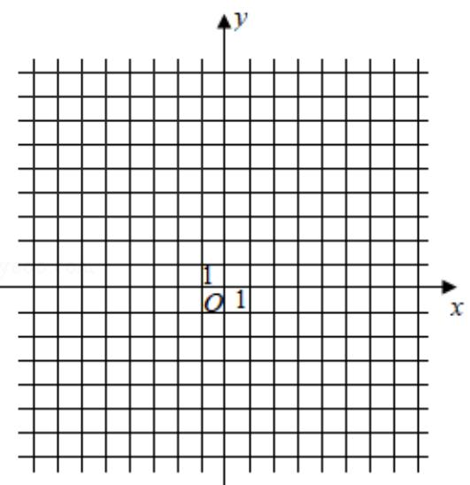

<!-- question-source:start -->
23. 设函数 $f(x) = |2x + 1| + |x - 1|$ .

(1) 画出 y=f (x) 的图象;

(2) 当 $x \in [0, +\infty)$ 时， $f(x) \leqslant ax + b$ ，求 $a + b$ 的最小值.

# 2018 年全国统一高考数学试卷（理科）（新课标III）

参考
<!-- question-source:end -->

![[高中/真题/按年份分类/2018/2018年全国统一高考数学试卷_理科__新课标ⅲ__含解析版_/解答题/题目/answers/Q00026674A1.md]]
