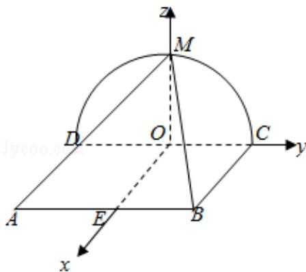

> [!faq]- 2018年全国统一高考数学试卷（理科）（新课标ⅲ）（含解析版）解析
>
> > [!success]- **【答案】** 详见解析
>
> > [!note]- **【分析】**
> > （1）根据面面垂直的判定定理证明MC⊥平面ADM即可.
>
> > [!note]- **【解析】**
> > 分析】（1）根据面面垂直的判定定理证明MC⊥平面ADM即可.
> >
> > (2) 根据三棱锥的体积最大, 确定 M 的位置, 建立空间直角坐标系, 求出点的坐
> >
> > 标，利用向量法进行求解即可.
> >
> > 【
> > 解答】解：（1）证明：在半圆中，DM⊥MC，
> >
> > ∵正方形 ABCD 所在的平面与半圆弧 CD 所在平面垂直，
> >
> > ∴AD⊥平面 DCM，则 AD⊥MC，
> >
> > ∵AD∩DM=D,
> >
> > ∴MC⊥平面 ADM,
> >
> > ∵MC⊂平面MBC,
> >
> > ∴平面 AMD⊥平面 BMC.
> >
> > (2) $\because \triangle ABC$ 的面积为定值，
> >
> > ∴要使三棱锥 M - ABC 体积最大，则三棱锥的高最大，
> >
> > 此时M为圆弧的中点，
> >
> > 建立以 O 为坐标原点，如图所示的空间直角坐标系如图
> >
> > ∵正方形 ABCD 的边长为 2，
> >
> > ∴A（2，-1，0），B（2，1，0），M（0，0，1），
> >
> > 则平面 MCD 的法向量 $\vec{\pi} = (1, 0, 0)$ ，
> >
> > 设平面 MAB 的法向量为 $\vec{n}=(x,y,z)$
> >
> > 则 $\overrightarrow{AB} = (0, 2, 0)$ ， $\overrightarrow{AM} = (-2, 1, 1)$ ，
> >
> > 由 $\vec{\mathrm{n}}\cdot \overrightarrow{\mathrm{AB}} = 2\mathrm{y} = 0$ ， $\vec{\mathrm{n}}\cdot \overrightarrow{\mathrm{AM}} = -2\mathrm{x} + \mathrm{y} + \mathrm{z} = 0,$
> >
> > 令 $x = 1$
> >
> > 则 y=0, z=2，即 $\vec{n}=(1,0,2)$ ，
> >
> > 则 $\cos < \vec{\pi}, \vec{n} > = \frac{\vec{m} \cdot \vec{n}}{|\vec{m}| |\vec{n}|} = \frac{1}{1 \times \sqrt{1 + 4}} = \frac{1}{\sqrt{5}}$
> >
> > 则面 MAB 与面 MCD 所成二面角的正弦值 $\sin \alpha = \sqrt{1 - (\frac{1}{\sqrt{5}})^2} = \frac{2\sqrt{5}}{5}$ .
> >
> > 
> >
> > 【点评】本题主要考查空间平面垂直的判定以及二面角的求解，利用相应的判定
> >
> > 定理以及建立坐标系，利用向量法是解决本题的关键.
