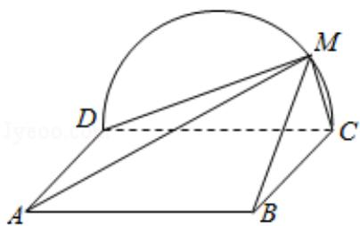

<!-- question-source:start -->
19.（12分）如图，边长为2的正方形ABCD所在的平面与半圆弧CD所在平面垂直，

M 是 $\widehat{CD}$ 上异于 C，D 的点.

(1) 证明：平面 AMD⊥平面 BMC;

(2) 当三棱锥 M-ABC 体积最大时，求面 MAB 与面 MCD 所成二面角的正弦值.

<!-- question-source:end -->

![[高中/真题/按年份分类/2018/2018年全国统一高考数学试卷_理科__新课标ⅲ__含解析版_/选择题/题目/answers/Q00026670A1.md]]
