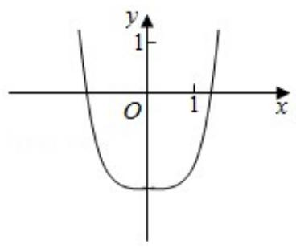
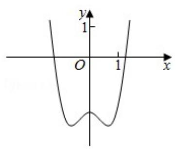
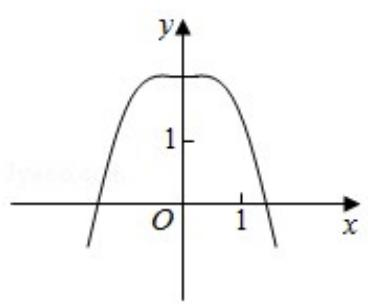
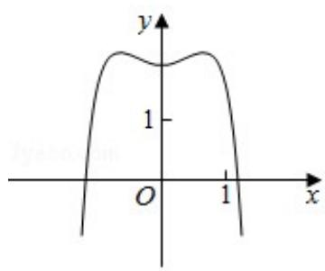

<!-- question-source:start -->
7. (5 分) 函数 $y = -x^4 + x^2 + 2$ 的图象大致为（）

  
A.

  
B.

  
C.

  
D.

【考点】3A：函数的图象与图象的变换.

【专题】38：对应思想；4R：转化法；51：函数的性质及应用.

【
<!-- question-source:end -->

![[高中/真题/按年份分类/2018/2018年全国统一高考数学试卷_理科__新课标ⅲ__含解析版_/选择题/题目/answers/Q00029742A1.md]]
