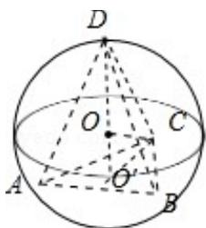

> [!faq]- 2018年全国统一高考数学试卷（理科）（新课标ⅲ）（含解析版）解析
>
> > [!success]- **【答案】** B
>
> > [!note]- **【分析】**
> > 求出， $\triangle ABC$ 为等边三角形的边长，画出图形，判断 D 的位置，然后求解即可.
>
> > [!note]- **【解析】**
> > 分析】求出， $\triangle ABC$ 为等边三角形的边长，画出图形，判断 D 的位置，然后求解即可.
> >
> > 【
> > 解答】解： $\triangle ABC$ 为等边三角形且面积为 $9\sqrt{3}$ ，可得 $\frac{\sqrt{3}}{4} \times AB^2 = 9\sqrt{3}$ ，解得 $AB = 6$ ，
> >
> > 球心为O，三角形ABC的外心为 $\mathrm{O}^{\prime}$ ，显然D在 $\mathrm{O}^{\prime}\mathrm{O}$ 的延长线与球的交点如图： $\mathrm{O}^{\prime}\mathrm{C} = \frac{2}{3}\times \frac{\sqrt{3}}{2}\times 6 = 2\sqrt{3},\mathrm{OO}^{\prime} = \sqrt{4^{2} - (2\sqrt{3})^{2}} = 2,$
> >
> > 则三棱锥 D - ABC 高的最大值为：6，
> >
> > 则三棱锥 D - ABC 体积的最大值为： $\frac{1}{3} \times \frac{\sqrt{3}}{4} \times 6^{3} = 18\sqrt{3}$ .
> >
> > 故选：B.
> >
> > 
> >
> > 【点评】本题考查球的内接多面体, 棱锥的体积的求法, 考查空间想象能力以及计算能力.
