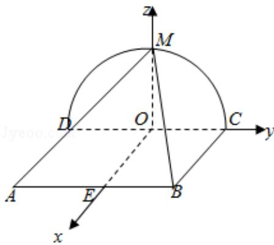

> [!faq]- 2018年全国统一高考数学试卷（理科）（新课标ⅲ）（含解析版）解析
>
> > [!success]- **【答案】** 详见解析
>
> > [!note]- **【分析】**
> > （1）根据面面垂直的判定定理证明 MC⊥平面 ADM 即可.
> > (2) 根据三棱锥的体积最大, 确定 M 的位置, 建立空间直角坐标系, 求出点的坐
>
> > [!note]- **【解析】**
> > 解：
> > （1）证明：在半圆中，DM⊥MC，
> >
> > ∵正方形 ABCD 所在的平面与半圆弧 CD 所在平面垂直，
> >
> > ∴AD⊥平面 DCM，则 AD⊥MC，
> >
> > ∵AD∩DM=D,
> >
> > ∴MC⊥平面ADM，
> >
> > ∵MCC平面 MBC,
> >
> > ∴平面 AMD⊥平面 BMC.
> > (2) $\because \triangle ABC$ 的面积为定值，
> >
> > ∴要使三棱锥 M - ABC 体积最大，则三棱锥的高最大，
> >
> > 此时 M 为圆弧的中点，
> >
> > 建立以 O 为坐标原点，如图所示的空间直角坐标系如图
> >
> > ∵正方形 ABCD 的边长为 2，
> >
> > $\therefore A(2, -1, 0), B(2, 1, 0), M(0, 0, 1)$
> >
> > 则平面 MCD 的法向量 $\vec{\pi} = (1, 0, 0)$ ，
> >
> > 设平面 MAB 的法向量为 $\vec{n}=(x,y,z)$
> >
> > 则 $\overrightarrow{AB} = (0, 2, 0)$ ， $\overrightarrow{AM} = (-2, 1, 1)$ ，
> >
> > 由 $\vec{n} \cdot \overrightarrow{AB} = 2y = 0, \vec{n} \cdot \overrightarrow{AM} = -2x + y + z = 0,$
> >
> > 令 $x = 1$
> >
> > 则 y=0, z=2，即 $\overrightarrow{n}=(1,0,2)$ ，
> >
> > 则 $\cos < \vec{\pi}, \vec{n} > = \frac{\vec{m} \cdot \vec{n}}{|\vec{m}| |\vec{n}|} = \frac{1}{1 \times \sqrt{1 + 4}} = \frac{1}{\sqrt{5}}$
> >
> > 则面 MAB 与面 MCD 所成二面角的正弦值 $\sin \alpha = \sqrt{1 - \left(\frac{1}{\sqrt{5}}\right)^2} = \frac{2\sqrt{5}}{5}$ .
> >
> > 
> >
> > 【点评】本题主要考查空间平面垂直的判定以及二面角的求解，利用相应的判定
> >
> > 定理以及建立坐标系，利用向量法是解决本题的关键.
