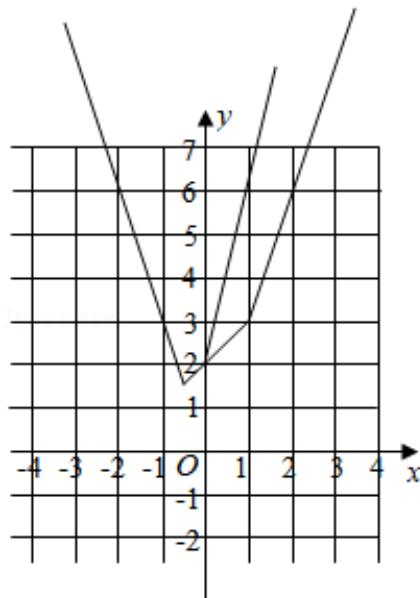
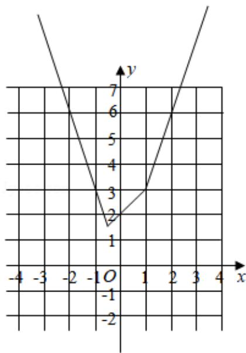

> [!faq]- 2018年全国统一高考数学试卷（理科）（新课标ⅲ）（含解析版）解析
>
> > [!success]- **【答案】** 详见解析
>
> > [!note]- **【分析】**
> > （1）利用分段函数的性质将函数表示为分段函数形式进行作图即可.
> > (2) 将不等式恒成立转化为图象关系进行求解即可.
>
> > [!note]- **【解析】**
> > 解：
> > （1）当 $x \leq -\frac{1}{2}$ 时， $f(x) = -(2x + 1) - (x - 1) = -3x$ ，
> >
> > 当 $-\frac{1}{2} < x < 1$ ， $f(x) = (2x + 1) - (x - 1) = x + 2$
> >
> > 当 $x \geq 1$ 时， $f(x) = (2x + 1) + (x - 1) = 3x$ ,
> >
> > 则 $f(x) = \begin{cases} -3x, & x \leqslant -\frac{1}{2} \\ x + 2, & \frac{1}{2} < x < 1 \\ 3x, & x \geqslant 1 \end{cases}$ 对应的图象为：
> >
> > 画出 y=f (x) 的图象；
> > (2) 当 $x \in [0, +\infty)$ 时， $f(x) \leqslant ax + b$ ,
> >
> > 当 x=0 时，f(0) =2≤0•a+b，∴b≥2，
> >
> > 当 $x > 0$ 时，要使 $f(x) \leqslant ax + b$ 恒成立，
> >
> > 则函数 f(x) 的图象都在直线 $y=ax+b$ 的下方或在直线上，
> >
> > ∵f（x）的图象与y轴的交点的纵坐标为2，
> >
> > 且各部分直线的斜率的最大值为 3，
> >
> > 故当且仅当 $a \geq 3$ 且 $b \geq 2$ 时，不等式 f(x) $\leq ax + b$ 在 $[0, +\infty)$ 上成立，
> >
> > 即 $a + b$ 的最小值为5.
> >
> > 
> >
> > 
> >
> > 【点评】本题主要考查分段函数的应用，利用不等式和函数之间的关系利用数形
> >
> > 结合是解决本题的关键.
