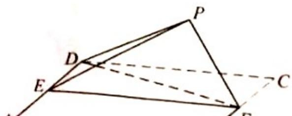

<!-- question-source:start -->
18. (12 分)

如图，四边形ABCD为正方形，E，F分别为AD，BC的中点，以DF为折痕把△DFC折起，使点C到达点P的位置，且 $PF\perp BF$ .

(1) 证明: 平面 $PEF \perp$ 平面 $ABFD$ ;

(2) 求 DP 与平面 ABFD 所成角的正弦值.
<!-- question-source:end -->

![[高中/真题/按年份分类/2018/2018年山东省高考数学试卷_理科_word版试卷及解析/解答题/题目/answers/Q00029426A1.md]]
