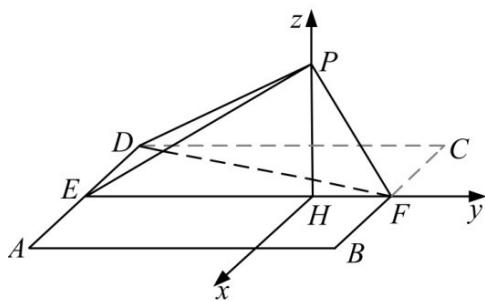

> [!faq]- 2018年山东省高考数学试卷(理科)word版试卷及解析解析
>
> > [!success]- **【答案】** 详见解析
>
> > [!note]- **【分析】**
> > 本题未单列分析。
>
> > [!note]- **【解析】**
> > 答案
> >
> > (1) 在 $\triangle ABD$ 中，由正弦定理得 $\frac{BD}{\sin\angle A} = \frac{AB}{\sin\angle ADB}$ .
> >
> > 由题设知， $\frac{5}{\sin45^{\circ}}=\frac{2}{\sin\angle ADB}$ ，所以 $\sin\angle ADB=\frac{\sqrt{2}}{5}$
> >
> > 由题设知， $\angle ADB < 90^{\circ}$ 所以 $\cos \angle ADB = \sqrt{1 - \frac{2}{25}} = \frac{\sqrt{23}}{5}$ .
> >
> > (2) 由题设及（1）知， $\cos \angle BDC = \sin \angle ADB = \frac{\sqrt{2}}{5}$ .
> >
> > 在 $\triangle BCD$ 中，由余弦定理得
> >
> > $$
> > \begin{array}{r l} B C ^ {2} & = B D ^ {2} + D C ^ {2} - 2 \cdot B D \cdot D C \cdot \cos \angle B D C \\ & = 2 5 + 8 - 2 \times 5 \times 2 \sqrt {2} \times \frac {\sqrt {2}}{5} \\ & = 2 5. \end{array}
> > $$
> >
> > 所以 BC = 5.
> >
> > 
