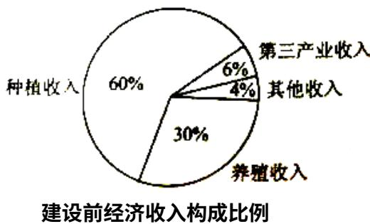
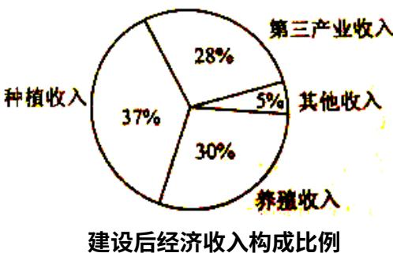

<!-- question-source:start -->
3、某地区经过一年的新农村建设，农村的经济收入增加了一倍，实现翻番，为更好地了解该地区农村的经济收入变化情况，统计了该地区新农村建设前后农村的经济收入构成比例，得到如下饼图：

则下面结论中不正确的是（）
A. 新农村建设后，种植收入减少
B. 新农村建设后，其他收入增加了一倍以上
C. 新农村建设后，养殖收入增加了一倍
D. 新农村建设后，养殖收入与第三产业收入的总和
<!-- question-source:end -->

![[高中/真题/按年份分类/2018/2018年山东省高考数学试卷_理科_word版试卷及解析/选择题/题目/answers/Q00025799A1.md]]
