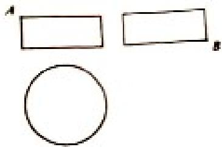

<!-- question-source:start -->
7、某圆柱的高为2，底面周长为16，其三视图如右图。圆柱表面上的点M在正视图上的对应点为A，圆柱表面上的点N在左视图上的对应点为B，则在此圆柱侧面上，从M到N的路径中，最短路径的长度为（）
A. $2\sqrt{17}$ B. $2\sqrt{5}$ C. 3
D. 2

<!-- question-source:end -->

![[高中/真题/按年份分类/2018/2018年山东省高考数学试卷_理科_word版试卷及解析/选择题/题目/answers/Q00025803A1.md]]
