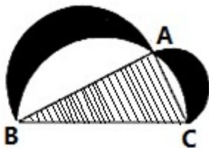

<!-- question-source:start -->
10.下图来自古希腊数学家希波克拉底所研究的几何图形。此图由三个半圆构成，三个半圆的直径分别为直角三角形ABC的斜边BC，直角边AB，AC.△ABC的三边所围成的区域记为Ⅰ，黑色部分记为Ⅱ，其余部分记为Ⅲ。在整个图形中随机取一点，此点取自Ⅰ，Ⅱ，Ⅲ的概率分别记为 $p_{1}$ ， $p_{2}$ ， $p_{3}$ ，则( )
A. $p_{1}=p_{2}$ B. $p_{1}=p_{3}$ C. $p_{2}=p_{3}$ D. $p_{1}=p_{2}+p_{3}$

<!-- question-source:end -->

![[高中/真题/按年份分类/2018/2018年山东省高考数学试卷_理科_word版试卷及解析/选择题/题目/answers/Q00025806A1.md]]
