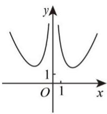
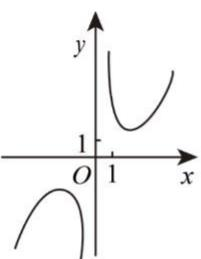
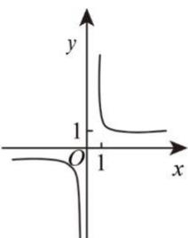
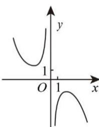
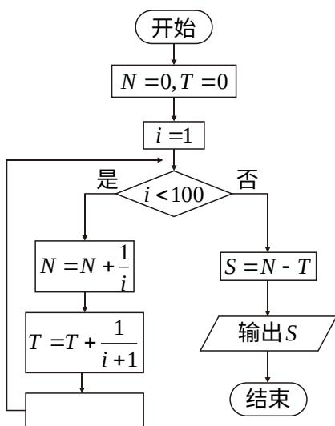

# 2018年普通高等学校招生全国统一考试

# 理科数学

注意事项：

1. 答卷前，考生务必将自己的姓名、准考证号填写在答题卡上。

2. 作答时，将答案写在答题卡上。写在本试卷及草稿纸上无效。

3. 考试结束后，将本试卷和答题卡一并交回。

一、选择题: 本题共 12 小题, 每小题 5 分, 共 60 分, 在每小题给出的四个选项中, 只有一项是符合题目要求的。
1. $\frac{1 + 2\mathrm{i}}{1 - 2\mathrm{i}} =$ A. $-\frac{4}{5} - \frac{3}{5}\mathrm{i}$ B. $-\frac{4}{5} + \frac{3}{5}\mathrm{i}$ C. $-\frac{3}{5} - \frac{4}{5}\mathrm{i}$ D. $-\frac{3}{5} + \frac{4}{5}\mathrm{i}$

2. 已知集合 $A = \left\{(x, y) \mid x^2 + y^2 \leq 3, x \in \mathbf{Z}, y \in \mathbf{Z}\right\}$ ，则 $A$ 中元素的个数为
A. 9 B. 8 C. 5 D. 4

3. 函数 $f(x) = \frac{\mathrm{e}^x - \mathrm{e}^{-x}}{x^2}$ 的图像大致为

  
A

B

C

  
D

4. 已知向量 $a$ ， $b$ 满足 $|a|=1$ ， $a \cdot b=-1$ ，则 $a \cdot (2a - b) =$ A. 4 B. 3 C. 2 D. 0

5. 双曲线 $\frac{x^2}{a^2} - \frac{y^2}{b^2} = 1 (a > 0, b > 0)$ 的离心率为 $\sqrt{3}$ ，则其渐近线方程为

A. $y = \pm \sqrt{2} x$ B. $y = \pm \sqrt{3} x$ C. $y = \pm \frac{\sqrt{2}}{2} x$ D. $y = \pm \frac{\sqrt{3}}{2} x$

6. 在 $\triangle ABC$ 中， $\cos \frac{C}{2} = \frac{\sqrt{5}}{5}$ ， $BC = 1$ ， $AC = 5$ ，则 $AB = A$ 。4√2 B. $\sqrt{30}$ C. $\sqrt{29}$ D. $2\sqrt{5}$

7. 为计算 $S = 1 - \frac{1}{2} + \frac{1}{3} - \frac{1}{4} + \ldots + \frac{1}{99} - \frac{1}{100}$ , 设计了右侧的程序框图, 则在空白框中应填入  
A. $i = i + 1$ B. $i = i + 2$ C. $i = i + 3$ D. $i = i + 4$

8. 我国数学家陈景润在哥德巴赫猜想的研究中取得了世界领先的成果。哥德巴赫猜想是“每个大于2的偶数可以表示为两个素数的和”，如 $30 = 7 + 23$ 。在不超过30的素数中，随机选取两个不同的数，其和等于30的概率是
A. $\frac{1}{12}$ B. $\frac{1}{14}$ C. $\frac{1}{15}$ D. $\frac{1}{18}$

9. 在长方体 $ABCD - A_{1}B_{1}C_{1}D_{1}$ 中， $AB = BC = 1$ ， $AA_{1} = \sqrt{3}$ ，则异面直线 $AD_{1}$ 与 $DB_{1}$ 所成角的余弦值为
A. $\frac{1}{5}$ B. $\frac{\sqrt{5}}{6}$ C. $\frac{\sqrt{5}}{5}$ D. $\frac{\sqrt{2}}{2}$

10. 若 $f(x) = \cos x - \sin x$ 在 $[-a, a]$ 是减函数，则 $a$ 的最大值是
A. $\frac{\pi}{4}$ B. $\frac{\pi}{2}$ C. $\frac{3\pi}{4}$ D. $\pi$

11. 已知 $f(x)$ 是定义域为 $(- \infty, +\infty)$ 的奇函数，满足 $f(1 - x) = f(1 + x)$ . 若 $f(1) = 2$ ，则 $f(1) + f(2) + f(3) + \ldots + f(50) =$ A. -50 B. 0 C. 2 D. 50

12. 已知 $F_{1}$ , $F_{2}$ 是椭圆 $C: \frac{x^{2}}{a^{2}} + \frac{y^{2}}{b^{2}} = 1 (a > b > 0)$ 的左, 右焦点, $A$ 是 $C$ 的左顶点, 点 $P$ 在过 $A$ 且斜率为 $\frac{\sqrt{3}}{6}$ 的直线上， $\triangle PF_{1}F_{2}$ 为等腰三角形， $\angle F_{1}F_{2}P = 120^{\circ}$ ，则 $C$ 的离心率为
A. $\frac{2}{3}$ B. $\frac{1}{2}$ C. $\frac{1}{3}$ D. $\frac{1}{4}$

##

![[高中/真题/按年份分类/2018/2018年理科数学海南省高考真题含答案/填空题/填空题.md]]
![[高中/真题/按年份分类/2018/2018年理科数学海南省高考真题含答案/解答题/解答题.md]]
![[高中/真题/按年份分类/2018/2018年理科数学海南省高考真题含答案/选择题/选择题.md]]
