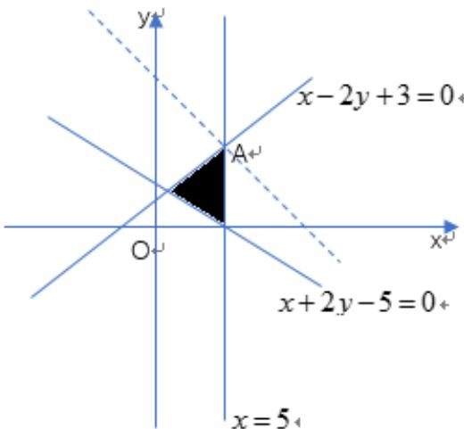

> [!faq]- 2018年理科数学海南省高考真题含答案解析
>
> > [!success]- **【答案】** 9
>
> > [!note]- **【分析】**
> > 先作可行域，再平移直线，确定目标函数最大值的取法.
>
> > [!note]- **【解析】**
> > 作可行域，则直线 $z=x+y$ 过点A(5,4)时取最大值9.
> >
> > 
> >
> > 点睛: 线性规划的实质是把代数问题几何化, 即数形结合的思想.需要注意的是: 一, 准确无误地作出可行域; 二, 画目标函数所对应的直线时, 要注意与约束条件中的直线的斜率进行比较, 避免出错; 三, 一般情况下, 目标函数的最大或最小值会在可行域的端点或边界上取得.
