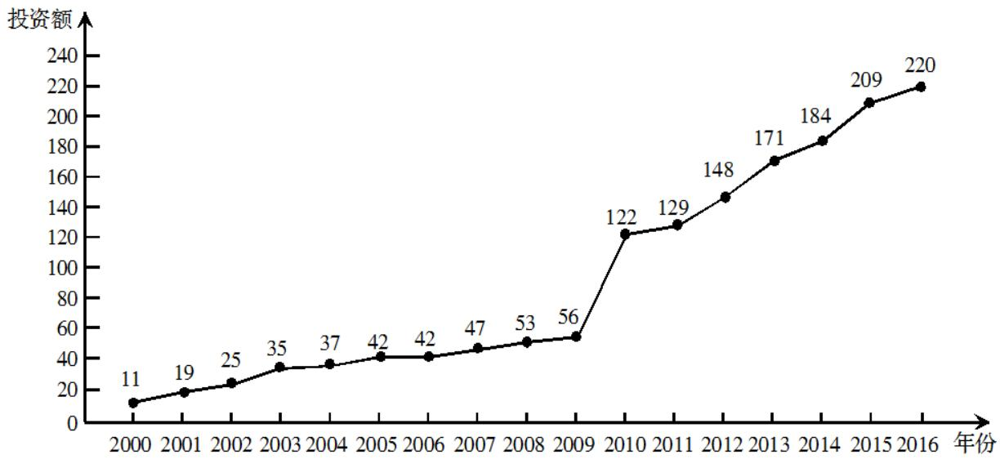
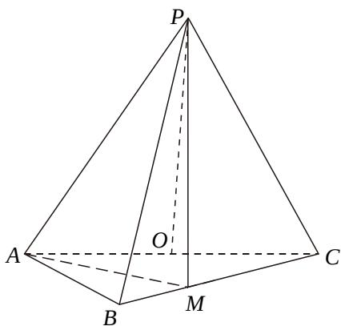

<!-- question-source:start -->
18. (12 分)

下图是某地区 2000 年至 2016 年环境基础设施投资额 $^{y}$ （单位：亿元）的折线图.

$$
1, 2, \dots , 1 7)
$$

$$
\hat {y} = - 3 0. 4 + 1 3. 5 t
$$

2016年的数据（时间变量t的值依次为 $1,2,\ldots,7$ ）建立模型②： $\hat{y}=99+17.5t$

(1) 分别利用这两个模型，求该地区 2018 年的环境基础设施投资额的预测值；

(2) 你认为用哪个模型得到的预测值更可靠？并说明理由．学科\*网

## 19. (12 分)

设抛物线 $C: y^{2} = 4x$ 的焦点为 F，过 F 且斜率为 $k (k > 0)$ 的直线 l 与 C 交于 A，B 两点， $|AB| = 8$ .

(1) 求 $l$ 的方程；

(2) 求过点 A，B 且与 C 的准线相切的圆的方程.

## 20. (12 分)

如图，在三棱锥 P-ABC 中， $AB=BC=2\sqrt{2}$ ，PA=PB=PC=AC=4，O 为 AC 的中点.

(1) 证明: $PO \perp$ 平面 $ABC$ ;

(2) 若点 $M$ 在棱 $BC$ 上，且二面角 $M - PA - C$ 为 $30^{\circ}$ ，求 $PC$ 与平面 $PAM$ 所成角的正弦值.

<!-- question-source:end -->

![[高中/真题/按年份分类/2018/2018年理科数学海南省高考真题含答案/解答题/题目/answers/Q00026060A1.md]]
