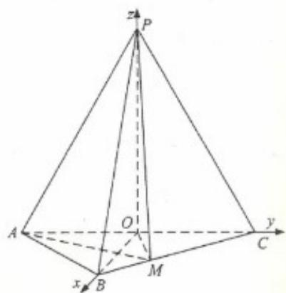

<!-- question-source:start -->
20.(12 分)

解：（1）因为 $AP = CP = AC = 4$ ， $O$ 为 $AC$ 的中点，所以 $OP \perp AC$ ，且 $OP = 2\sqrt{3}$ .

连结 OB . 因为 $AB = BC = \frac{\sqrt{2}}{2} AC$ ，所以 $\triangle ABC$ 为等腰直角三角形，

且 $OB \perp AC$ ， $OB = \frac{1}{2} AC = 2$ .

由 $OP^{2}+OB^{2}=PB^{2}$ 知 $PO\perp OB$ .

由 $OP \perp OB, OP \perp AC$ 知 $PO \perp$ 平面 $ABC$ .

(2) 如图, 以 $O$ 为坐标原点, $\frac{u}{OB}$ 的方向为 $x$ 轴正方向, 建立空间直角坐标系 $O - xyz$ .

由已知得 $O(0,0,0), B(2,0,0), A(0,-2,0), C(0,2,0), P(0,0,2\sqrt{3}), AP = (0,2,2\sqrt{3})$ ，取平面 $PAC$ 的法向量 $OB = (2,0,0)$ .

设 $M(a,2 - a,0)(0 < a\leq 2)$ ，则 $\mathbf{AM} = (a,4 - a,0)$

设平面 $PAM$ 的法向量为 $\pmb {n} = (x,y,z)$

由 $\mathbf{A}P\cdot \mathbf{n} = 0,\mathbf{A}M\cdot \mathbf{n} = 0$ 得 $\left\{ \begin{array}{l}2y + 2\sqrt{3} z = 0\\ ax + (4 - a)y = 0 \end{array} \right.$ ，可取 $\pmb {n} = (\sqrt{3} (a - 4),\sqrt{3} a, - a)$

所以 $\cos\left\langle OB,n\right\rangle=\frac{2\sqrt{3}(a-4)}{2\sqrt{3(a-4)^{2}+3a^{2}+a^{2}}}$ . 由已知得 $\left|\cos\left\langle OB,n\right\rangle\right|=\frac{\sqrt{3}}{2}$ .

所以 $\frac{2\sqrt{3}|a-4|}{2\sqrt{3(a-4)^{2}+3a^{2}+a^{2}}}=\frac{\sqrt{3}}{2}$ . 解得 a=-4 （舍去）， $a=\frac{4}{3}$ .

所以 $\boldsymbol{n}=(-\frac{8\sqrt{3}}{3},\frac{4\sqrt{3}}{3},-\frac{4}{3})$ . 又 $PC=(0,2,-2\sqrt{3})$ ，所以 $\cos\left\langle PC,n\right\rangle=\frac{\sqrt{3}}{4}$ .

所以 $PC$ 与平面 $PAM$ 所成角的正弦值为 $\frac{\sqrt{3}}{4}$ .
<!-- question-source:end -->

![[高中/真题/按年份分类/2018/2018年理科数学海南省高考真题含答案/解答题/题目/answers/Q00026067A1.md]]
