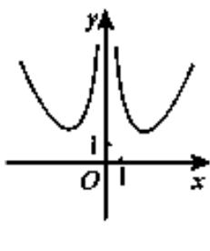
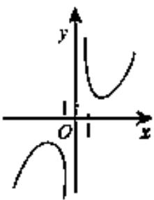
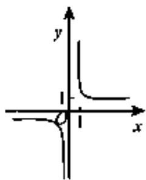
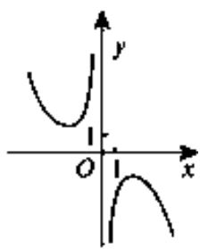

<!-- question-source:start -->
3. 函数 $f(x)=\frac{e^{x}-e^{-x}}{x^{2}}$ 的图像大致为

A

B

  
C

D

A. A B. B C. C D. D

【
<!-- question-source:end -->

![[高中/真题/按年份分类/2018/2018年理科数学海南省高考真题含答案/选择题/题目/answers/Q00026069A1.md]]
