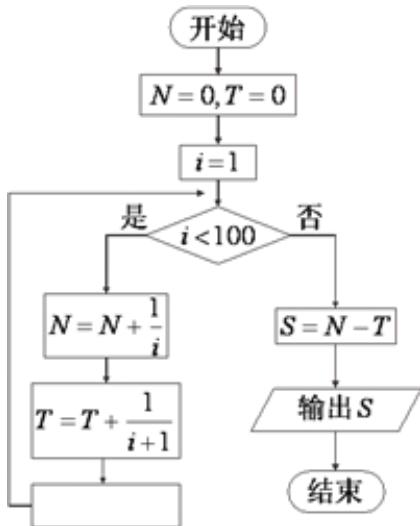

<!-- question-source:start -->
7. 为计算 $S = 1 - \frac{1}{2} + \frac{1}{3} - \frac{1}{4} + \ldots + \frac{1}{99} - \frac{1}{100}$ ，设计了下面的程序框图，则在空白框中应填入

A. $\mathrm{i} = \mathrm{i} + 1$

B. $\mathrm{i} = \mathrm{i} + 2$

C. $\mathrm{i} = \mathrm{i} + 3$

D. $\mathrm{i} = \mathrm{i} + 4$

【
<!-- question-source:end -->

![[高中/真题/按年份分类/2018/2018年理科数学海南省高考真题含答案/选择题/题目/answers/Q00028839A1.md]]
