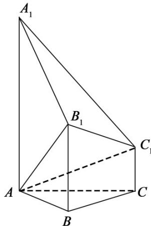

<!-- question-source:start -->
19. （本题满分 15 分）如图，已知多面体 $ABCA_{1}B_{1}C_{1}$ ， $A_{1}A$ ， $B_{1}B$ ， $C_{1}C$ 均垂直于平面 $ABC$ ， $\angle ABC = 120^{\circ}$ ， $A_{1}A = 4$ ， $C_{1}C = 1$ ， $AB = BC = B_{1}B = 2$ 。

（Ⅰ）证明： $AB_{1}$ ⊥ 平面 $A_{1}B_{1}C_{1}$ ;

（II）求直线 $AC_{1}$ 与平面 $ABB_{1}$ 所成的角的正弦值.
<!-- question-source:end -->

![[高中/真题/按年份分类/2018/2018年高考浙江高考数学试题及答案_精校版_/填空题/题目/answers/Q00022708A1.md]]
