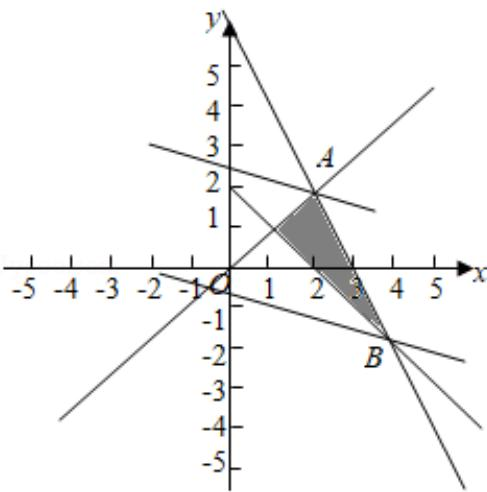

> [!faq]- 2018年高考浙江高考数学试题及答案(精校版)解析
>
> > [!success]- **【答案】** 为：-2；8.  【点评】本题给出二元一次不等式组，求目标函数的最小值，着重考查了二元 一次不等式组表示的平面区域和简单的线性规划等知识，属于中档题.
>
> > [!note]- **【分析】**
> > 作出题中不等式组表示的平面区域，得到如图的△ABC及其内部，再
>
> > [!note]- **【解析】**
> > 分析】作出题中不等式组表示的平面区域，得到如图的△ABC及其内部，再
> >
> > 将目标函数 $z = x + 3y$ 对应的直线进行平移，观察直线在 $y$ 轴上的截距变化，然
> >
> > 后求解最优解得到结果.
> >
> > 【
> > 解答】解：作出 $x$ ，y满足约束条件 $\left\lfloor x + y\right\rceil = 2$ 表示的平面区域，
> >
> > $$
> > \left\{ \begin{array}{l} x - y \geqslant 0 \\ 2 x + y \leqslant 6 \\ x + y \geqslant 2 \end{array} \right.
> > $$
> >
> > 如图:
> >
> > 其中 B（4，-2），A（2，2）。
> >
> > 设 $z=F(x, y)=x+3y$ ,
> >
> > 将直线 l: $z=x+3y$ 进行平移，观察直线在 y 轴上的截距变化，
> >
> > 可得当 I 经过点 B 时，目标函数 z 达到最小值.
> >
> > $\therefore z_{最小值}=F(4,-2)=-2.$
> >
> > 可得当 I 经过点 A 时，目标函数 z 达到最最大值：
> >
> > $z_{最大值}=F(2,2)=8.$
> >
> > 故
> > 答案为：-2；8.
> >
> > 
> >
> > 【点评】本题给出二元一次不等式组，求目标函数的最小值，着重考查了二元
> >
> > 一次不等式组表示的平面区域和简单的线性规划等知识，属于中档题.
