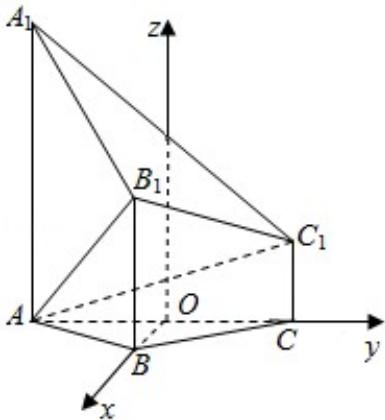

> [!faq]- 2018年高考浙江高考数学试题及答案(精校版)解析
>
> > [!success]- **【答案】** 详见解析
>
> > [!note]- **【分析】**
> > （I）利用勾股定理的逆定理证明 $AB_{1} \perp A_{1}B_{1}$ ， $AB_{1} \perp B_{1}C_{1}$ ，从而可得
>
> > [!note]- **【解析】**
> > （Ⅰ）证明：∵A₁A⊥平面ABC，B₁B⊥平面ABC，
> >
> > $\therefore AA_{1}\|BB_{1},$
> >
> > $\because AA_{1}=4,\ BB_{1}=2,\ AB=2,$
> >
> > $$
> > \therefore A _ {1} B _ {1} = \sqrt {\left(A B\right) ^ {2} + \left(A A _ {1} - B B _ {1}\right) ^ {2}} = 2 \sqrt {2},
> > $$
> >
> > 又 $AB_{1}=\sqrt{AB^{2}+BB_{1}^{2}}=2\sqrt{2},\therefore AA_{1}^{2}=AB_{1}^{2}+A_{1}B_{1}^{2},$
> >
> > $$
> > \therefore A B _ {1} \perp A _ {1} B _ {1},
> > $$
> >
> > 同理可得： $AB_{1}\perp B_{1}C_{1}$ ，
> >
> > 又 $A_{1}B_{1}\cap B_{1}C_{1}=B_{1}$ ,
> >
> > $\therefore AB_{1} \perp$ 平面 $A_{1}B_{1}C_{1}$ .
> >
> > (II) 解: 取 AC 中点 O, 过 O 作平面 ABC 的垂线 OD, 交 $A_{1}C_{1}$ 于 D,
> >
> > $$
> > \because A B = B C, \therefore O B \perp O C,
> > $$
> >
> > $$
> > \because A B = B C = 2, \angle B A C = 1 2 0 ^ {\circ}, \therefore O B = 1, O A = O C = \sqrt {3},
> > $$
> >
> > 以 O 为原点，以 OB，OC，OD 所在直线为坐标轴建立空间直角坐标系如图所示：
> >
> > 则 A $(0, -\sqrt{3}, 0)$ ，B $(1, 0, 0)$ ， $B_{1}(1, 0, 2)$ ， $C_{1}(0, \sqrt{3}, 1)$ ，
> >
> > $$
> > \therefore \overrightarrow {\mathrm{AB}} = (1, \sqrt {3}, 0), \overrightarrow {\mathrm{BB}} _ {1} = (0, 0, 2), \overrightarrow {\mathrm{AC}} _ {1} = (0, 2 \sqrt {3}, 1),
> > $$
> >
> > 设平面 $ABB_{1}$ 的法向量为 $\vec{n} = (x, y, z)$ ，则 $\left\{\begin{aligned}\vec{n} & \cdot \overrightarrow{AB} = 0 \\ \vec{n} & \cdot \overrightarrow{BB_{1}} = 0\end{aligned}\right.$
> >
> > $\therefore \left\{ \begin{array}{l} x + \sqrt{3} y = 0 \\ 2z = 0 \end{array} \right.$ ，令 $y = 1$ 可得 $\vec{n} = (-\sqrt{3}, 1, 0)$ ，
> >
> > $$
> > \therefore \cos <   \overrightarrow {n}, \overrightarrow {A C _ {1}} > = \frac {\overrightarrow {n} \cdot \overrightarrow {A C _ {1}}}{| \overrightarrow {n} | | \overrightarrow {A C _ {1}} |} = \frac {2 \sqrt {3}}{2 \times \sqrt {1 3}} = \frac {\sqrt {3 9}}{1 3}.
> > $$
> >
> > 设直线 $AC_{1}$ 与平面 $ABB_{1}$ 所成的角为 $\theta$ ，则 $\sin\theta=|\cos<\overrightarrow{n},\overrightarrow{AC_{1}}>|=\frac{\sqrt{39}}{13}$ .
> > ∴直线 $AC_{1}$ 与平面 $ABB_{1}$ 所成的角的正弦值为 $\frac{\sqrt{39}}{13}$ .
> >
> > 
> >
> > 【点评】本题考查了线面垂直的判定定理，线面角的计算与空间向量的应用，
> > 属于中档题.
