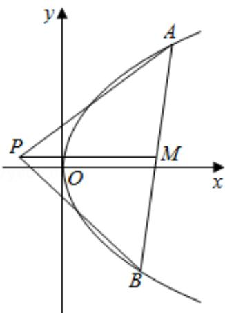

> [!faq]- 2018年高考浙江高考数学试题及答案(精校版)解析
>
> > [!success]- **【答案】** 详见解析
>
> > [!note]- **【分析】**
> > 法；5D：圆锥曲线的定义、性质与方程.
>
> > [!note]- **【解析】**
> > 解：（I）证明：可设P(m，n)，A $\left(\frac{y_{1}^{2}}{4},y_{1}\right)$ ，B $\left(\frac{y_{2}^{2}}{4},y_{2}\right)$ ，AB中点为M的坐标为 $\left(\frac{y_{1}^{2}+y_{2}^{2}}{8},\frac{y_{1}+y_{2}}{2}\right)$ ，
> >
> > 抛物线 C: $y^{2}=4x$ 上存在不同的两点 A, B 满足 PA, PB 的中点均在 C 上,
> >
> > 可得 $\frac{n+y_{1}}{2}$ $^{2}=4\bullet\frac{\pi+\frac{y_{1}^{2}}{4}}{2}$ ,
> >
> > $$
> > \frac {\mathrm{n} + \mathrm{y} _ {2}}{(2)} ^ {2} = 4 \bullet \frac {\mathrm{n} + \frac {1}{4} \mathrm{y} _ {2} ^ {2}}{2},
> > $$
> >
> > 化简可得 $y_{1}$ ， $y_{2}$ 为关于 y 的方程 $y^{2}-2ny+8m-n^{2}=0$ 的两根，
> >
> > 可得 $y_{1}+y_{2}=2n,\quad y_{1}y_{2}=8m-n^{2},$
> >
> > 可得 $n = \frac{y_1 + y_2}{2}$
> >
> > 则 PM 垂直于 y 轴；
> >
> > （II）若 P 是半椭圆 $x^{2}+\frac{y^{2}}{4}=1$ （x<0）上的动点，
> >
> > 可得 $m^2 + \frac{n^2}{4} = 1, -1 \leq m < 0, -2 < n < 2,$
> >
> > 由（Ⅰ）可得 $y_{1}+y_{2}=2n,\quad y_{1}y_{2}=8m-n^{2}$
> >
> > 由PM垂直于y轴，可得△PAB面积为 $S=\frac{1}{2}|PM|\bullet|y_{1}-y_{2}|$ $=\frac{1}{2}\left(\frac{y_{1}^{2}+y_{2}^{2}}{8}-m\right)\cdot\sqrt{(y_{1}+y_{2})^{2}-4y_{1}y_{2}}$ $=[\frac{1}{16}\bullet(4n^{2}-16m+2n^{2})-\frac{1}{2}m]\bullet\sqrt{4n^{2}-32\pi+4n^{2}}$ $=\frac{3\sqrt{2}}{4}(n^{2}-4m)\sqrt{n^{2}-4\pi},$
> >
> > 可令 $t = \sqrt{n^2 - 4\pi} = \sqrt{4 - 4m^2 - 4\pi}$
> >
> > $$
> > = \sqrt {- 4 \left(\mathrm{m} + \frac {1}{2}\right) ^ {2} + 5},
> > $$
> >
> > 可得 $m = -\frac{1}{2}$ 时，t取得最大值 $\sqrt{5}$
> >
> > m=-1 时，t 取得最小值 2，
> >
> > 即 $2 \leq t \leq \sqrt{5}$ ,
> >
> > 则 $S = \frac{3\sqrt{2}}{4} t^3$ 在 $2\leq t\leq \sqrt{5}$ 递增，可得 $S\in [6\sqrt{2},\frac{15}{4}\sqrt{10} ]$
> >
> > △PAB面积的取值范围为[6√2， $\frac{15}{4}\sqrt{10}$ ].
> >
> > 
> >
> > 【点评】本题考查抛物线的方程和运用，考查转化思想和运算能力，以及换元
> >
> > 法和三次函数的单调性，属于难题.
