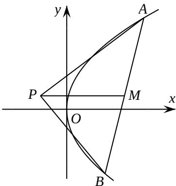

<!-- question-source:start -->
21. （本题满分 15 分）如图，已知点 P 是 y 轴左侧(不含 y 轴)一点，抛物线 C: $y^{2}=4x$ 上存

在不同的两点 A, B 满足 PA, PB 的中点均在 C 上.

（Ⅰ）设 AB 中点为 M，证明：PM 垂直于 y 轴；

（Ⅱ）若 $P$ 是半椭圆 $x^{2} + \frac{y^{2}}{4} = 1 (x < 0)$ 上的动点，求 $\triangle PAB$ 面积的取值范围.
<!-- question-source:end -->

![[高中/真题/按年份分类/2018/2018年高考浙江高考数学试题及答案_精校版_/解答题/题目/answers/Q00022710A1.md]]
