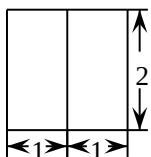
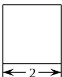
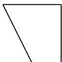

<!-- question-source:start -->
3. 某几何体的三视图如图所示（单位：cm），则该几何体的体积（单位： $\mathrm{cm}^3$ ）是

  
正视图

  
侧视图

  
俯视图

A. 2 B. 4 C. 6 D. 8
<!-- question-source:end -->

![[高中/真题/按年份分类/2018/2018年高考浙江高考数学试题及答案_精校版_/选择题/题目/answers/Q00022692A1.md]]
