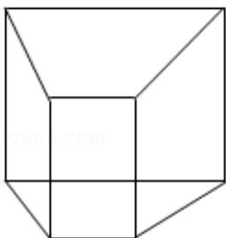

> [!faq]- 2018年高考浙江高考数学试题及答案(精校版)解析
>
> > [!success]- **【答案】** C
>
> > [!note]- **【分析】**
> > 直接利用三视图的复原图求出几何体的体积.
>
> > [!note]- **【解析】**
> > 分析】直接利用三视图的复原图求出几何体的体积.
> >
> > 【
> > 解答】解：根据三视图：该几何体为底面为直角梯形的四棱柱.
> >
> > 如图所示:
> >
> > 故该几何体的体积为： $V=\frac{1}{2}(1+2)\cdot2\cdot2=6$
> >
> > 故选：C.
> >
> > 
> >
> > 【点评】本题考查的知识要点：三视图的应用.
