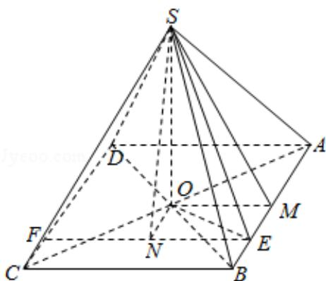

> [!faq]- 2018年高考浙江高考数学试题及答案(精校版)解析
>
> > [!success]- **【答案】** D
>
> > [!note]- **【分析】**
> > 作出三个角，表示出三个角的正弦或正切值，根据三角函数的单调性
>
> > [!note]- **【解析】**
> > 解：∵由题意可知 S 在底面 ABCD 的射影为正方形 ABCD 的中心.
> >
> > 过 E 作 EF∥BC，交 CD 于 F，过底面 ABCD 的中心 O 作 ON⊥EF 交 EF 于 N，
> >
> > 连接 SN，
> >
> > 取 AB 中点 M，连接 SM，OM，OE，则 EN=OM，
> >
> > 则 $\theta_{1}=\angle SEN,\quad\theta_{2}=\angle SEO,\quad\theta_{3}=\angle SMO.$
> >
> > 显然， $\theta_{1}$ ， $\theta_{2}$ ， $\theta_{3}$ 均为锐角。
> >
> > $\because \tan \theta_{1} = \frac{\overline{SN}}{\overline{NE}} = \frac{\overline{SN}}{\overline{OM}}, \tan \theta_{3} = \frac{\overline{SO}}{\overline{OM}}, SN \geq SO,$
> >
> > $$
> > \therefore \theta_ {1} \geq \theta_ {3},
> > $$
> >
> > 又 $\sin \theta_{3} = \frac{\mathrm{SO}}{\mathrm{SM}}$ ， $\sin \theta_{2} = \frac{\mathrm{SO}}{\mathrm{SE}}$ ， $SE\geq SM$
> >
> > $$
> > \therefore \theta_ {3} \geq \theta_ {2}.
> > $$
> >
> > 故选：D.
> >
> > 
> >
> > 【点评】本题考查了空间角的计算，三角函数的应用，属于中档题.
