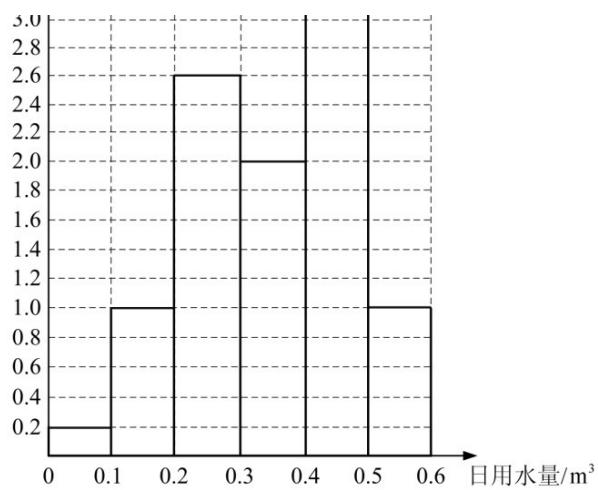

# 2018年普通高等学校招生全国统一考试文科数学试题参考答案

##
一、选择题

1. A 2. C 3. A 4. C 5. B 6. D  
7. A 8. B 9. B 10. C 11. B 12. D

二、填空题13. -7 14. 6 $15.2\sqrt{2} 16.\frac{2\sqrt{3}}{3}$

##
三、解答题

17. 解:

(1) 由条件可得 $a_{n+1} = \frac{2(n+1)}{n} a_n$ .  
将 $n = 1$ 代入得， $a_2 = 4a_1$ ，而 $a_1 = 1$ ，所以， $a_2 = 4$ .  
将 $n = 2$ 代入得， $a_3 = 3a_2$ ，所以， $a_3 = 12$ .  
从而 $b_1 = 1, b_2 = 2, b_3 = 4$ .

(2) $\{b_{n}\}$ 是首项为1，公比为2的等比数列.

由条件可得 $\frac{a_{n + 1}}{n + 1} = \frac{2a_n}{n}$ ，即 $b_{n + 1} = 2b_{n}$ ，又 $b_{1} = 1$ ，所以 $\{b_n\}$ 是首项为1，公比为2的等比数列.

(3) 由
(2) 可得 $\frac{a_n}{n} = 2^{n-1}$ , 所以 $a_n = n \cdot 2^{n-1}$ .

18. 解:

(1) 由已知可得， $\angle BAC = 90^{\circ}$ ， $BA \perp AC$ 。又 $BA \perp AD$ ，所以 $AB \perp$ 平面 $ACD$ 。又 $AB \subset$ 平面 $ABC$ ，所以平面 $ACD \perp$ 平面 $ABC$ 。

(2) 由已知可得， $DC = CM = AB = 3$ ， $DA = 3\sqrt{2}$ . 又 $BP = DQ = \frac{2}{3} DA$ ，所以 $BP = 2\sqrt{2}$ .

作 $QE \perp AC$ ，垂足为E，则 $QE \cong \frac{1}{3} DC$ .

由已知及
（1）可得 $DC \perp$ 平面 ABC，所以 $QE \perp$ 平面 ABC，QE = 1.
因此，三棱锥 Q - ABP 的体积为

$$
V _ {Q - A B P} = \frac {1}{3} \times Q E \times S _ {\triangle A B P} = \frac {1}{3} \times 1 \times \frac {1}{2} \times 3 \times 2 \sqrt {2} \sin 4 5 ^ {\circ} = 1.
$$

19. 解:

(1)

(2) 根据以上数据, 该家庭使用节水龙头后 50 天日用水量小于 $0.35 \mathrm{~m}^{3}$ 的频率为 $0.2 \times 0.1 + 1 \times 0.1 + 2.6 \times 0.1 + 2 \times 0.05 = 0.48$ ,

因此该家庭使用节水龙头后日用水量小于 $0.35 \, m^{3}$ 的概率的估计值为 0.48.

(3) 该家庭未使用节水龙头 50 天日用水量的平均数为

$$
\bar {x} _ {1} = \frac {1}{5 0} (0. 0 5 \times 1 + 0. 1 5 \times 3 + 0. 2 5 \times 2 + 0. 3 5 \times 4 + 0. 4 5 \times 9 + 0. 5 5 \times 2 6 + 0. 6 5 \times 5) = 0. 4 8.
$$

该家庭使用了节水龙头后50天日用水量的平均数为

$$
\bar {x} _ {2} = \frac {1}{5 0} (0. 0 5 \times 1 + 0. 1 5 \times 5 + 0. 2 5 \times 1 3 + 0. 3 5 \times 1 0 + 0. 4 5 \times 1 6 + 0. 5 5 \times 5) = 0. 3 5.
$$

20. 解:

(1) 当 l 与 x 轴垂直时，l 的方程为 x=2 ，可得 M 的坐标为 $(2,2)$ 或 $(2,-2)$ .

所以直线 BM 的方程为 $y=\frac{1}{2}x+1$ 或 $y=-\frac{1}{2}x-1$ .

(2) 当 $l$ 与 $x$ 轴垂直时， $AB$ 为 $MN$ 的垂直平分线，所以 $\angle ABM = \angle ABN$ . 当 $l$ 与 $x$ 轴不垂直时，设 $l$ 的方程为 $y = k(x - 2)(k \neq 0)$ ， $M(x_1, y_1)$ ， $N(x_2, y_2)$ ，则

$x_{1} > 0, x_{2} > 0$

由 $\left\{\begin{aligned}y&=k(x-2),\\ y^{2}&=2x\end{aligned}\right.$ 得 $ky^{2}-2y-4k=0$ ，可知 $y_{1}+y_{2}=\frac{2}{k},y_{1}y_{2}=-4$ .

直线 BM，BN 的斜率之和为

$$
k _ {B M} + k _ {B N} = \frac {y _ {1}}{x _ {1} + 2} + \frac {y _ {2}}{x _ {2} + 2} = \frac {x _ {2} y _ {1} + x _ {1} y _ {2} + 2 (y _ {1} + y _ {2})}{(x _ {1} + 2) (x _ {2} + 2)}. \tag {①}
$$

将 $x_{1} = \frac{y_{1}}{k} +2$ ， $x_{2} = \frac{y_{2}}{k} +2$ 及 $y_{1} + y_{2}$ ， $y_{1}y_{2}$ 的表达式代入①式分子，可得

$$
x _ {2} y _ {1} + x _ {1} y _ {2} + 2 \left(y _ {1} + y _ {2}\right) = \frac {2 y _ {1} y _ {2} + 4 k \left(y _ {1} + y _ {2}\right)}{k} = \frac {- 8 + 8}{k} = 0.
$$

所以 $k_{BM} + k_{BN} = 0$ ，可知BM，BN的倾斜角互补，所以 $\angle ABM = \angle ABN$ 综上， $\angle ABM = \angle ABN$

21. 解:

(1) $f(x)$ 的定义域为 $(0, +\infty)$ ， $f'(x) = ae^{x} - \frac{1}{x}$ .

由题设知， $f'(2)=0$ ，所以 $a=\frac{1}{2e^{2}}$ .

从而 $f(x) = \frac{1}{2\mathrm{e}^2}\mathrm{e}^x -\ln x - 1,\quad f'(x) = \frac{1}{2\mathrm{e}^2}\mathrm{e}^x -\frac{1}{x}.$

当 0 < x < 2 时， $f'(x) < 0$ ；当 x > 2 时， $f'(x) > 0$ .

所以 $f(x)$ 在 $(0,2)$ 单调递减，在 $(2,+\infty)$ 单调递增.

(2) 当 $a \geq \frac{1}{\mathrm{e}}$ 时， $f(x) \geq \frac{\mathrm{e}^x}{\mathrm{e}} - \ln x - 1$ .

设 $g(x) = \frac{\mathrm{e}^x}{\mathrm{e}} - \ln x - 1$ ，则 $g'(x) = \frac{\mathrm{e}^x}{\mathrm{e}} - \frac{1}{x}$ .

当 0 < x < 1 时， $g'(x) < 0$ ；当 x > 1 时， $g'(x) > 0$ 。所以 x = 1 是 $g(x)$ 的最小值点。

故当 $x > 0$ 时， $g(x) \geq g(1) = 0$ .

因此，当 $a \geq \frac{1}{\mathrm{e}}$ 时， $f(x) \geq 0$ 。

22. 解:

(1) 由 $x = \rho \cos \theta$ ， $y = \rho \sin \theta$ 得 $C_2$ 的直角坐标方程为

$$
(x + 1) ^ {2} + y ^ {2} = 4.
$$

(2) 由
(1) 知 $C_{2}$ 是圆心为 $A(-1,0)$ , 半径为 2 的圆.

由题设知， $C_{1}$ 是过点 $B(0,2)$ 且关于 y 轴对称的两条射线。记 y 轴右边的射线为 $l_{1}$ ，y 轴左边的射线为 $l_{2}$ 。由于 B 在圆 $C_{2}$ 的外面，故 $C_{1}$ 与 $C_{2}$ 有且仅有三个公共点等价于 $l_{1}$ 与 $C_{2}$ 只有一个公共点且 $l_{2}$ 与 $C_{2}$ 有两个公共点，或 $l_{2}$ 与 $C_{2}$ 只有一个公共点且 $l_{1}$ 与 $C_{2}$ 有两个公共点。

当 $l_{1}$ 与 $C_2$ 只有一个公共点时， $A$ 到 $l_{1}$ 所在直线的距离为2，所以 $\frac{|-k + 2|}{\sqrt{k^2 + 1}} = 2$ ，故 $k = -\frac{4}{3}$ 或 $k = 0$ 。经检验，当 $k = 0$ 时， $l_{1}$ 与 $C_2$ 没有公共点；当 $k = -\frac{4}{3}$ 时， $l_{1}$ 与 $C_2$ 只有一个公共点， $l_{2}$ 与 $C_2$ 有两个公共点。

当 $l_{2}$ 与 $C_2$ 只有一个公共点时， $A$ 到 $l_{2}$ 所在直线的距离为2，所以 $\frac{|k + 2|}{\sqrt{k^2 + 1}} = 2$ ，故 $k = 0$ 或 $k = \frac{4}{3}$ . 经检验，当 $k = 0$ 时， $l_{1}$ 与 $C_2$ 没有公共点；当 $k = \frac{4}{3}$ 时， $l_{2}$ 与 $C_2$ 没有公共点.

综上，所求 $C_{1}$ 的方程为 $y = -\frac{4}{3}|x| + 2$ .

23. 解:

(1) 当 $a = 1$ 时， $f(x) \neq |x + 1| - |x - 1|$ ，即 $f(x) = \begin{cases} -2, & x \leq -1, \\ 2x, & -1 < x < 1, \\ 2, & x \geq 1. \end{cases}$

故不等式 $f(x)>1$ 的解集为 $\{x\mid x>\frac{1}{2}\}$ .

(2) 当 $x \in (0,1)$ 时 $|x + 1| - |ax - 1| > x$ 成立等价于当 $x \in (0,1)$ 时 $|ax - 1| < 1$ 成立. 若 $a \leq 0$ ，则当 $x \in (0,1)$ 时 $|ax - 1| \geq 1$ ；

若 $a > 0$ ， $\vert ax - 1\vert < 1$ 的解集为 $0 < x < \frac{2}{a}$ ，所以 $\frac{2}{a} \geq 1$ ，故 $0 < a \leq 2$

综上，a 的取值范围为 $(0,2]$ .

## 2018年全国统一高考数学试卷（文科）（全国新课标Ⅰ）

参考答案与试题解析

##

![[高中/真题/按年份分类/2018/2018年高考真题数学_文__山东卷__含解析版_/选择题/选择题.md]]
![[高中/真题/按年份分类/2018/2018年高考真题数学_文__山东卷__含解析版_/填空题/填空题.md]]
![[高中/真题/按年份分类/2018/2018年高考真题数学_文__山东卷__含解析版_/解答题/解答题.md]]
