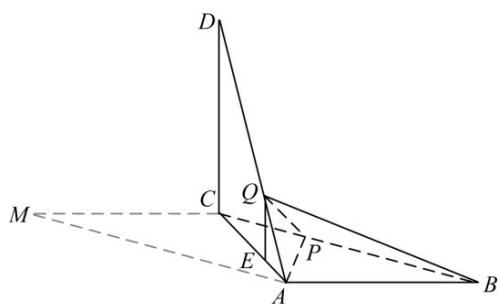

<!-- question-source:start -->
18. 解:

(1) 由已知可得， $\angle BAC = 90^{\circ}$ ， $BA \perp AC$ 。又 $BA \perp AD$ ，所以 $AB \perp$ 平面 $ACD$ 。又 $AB \subset$ 平面 $ABC$ ，所以平面 $ACD \perp$ 平面 $ABC$ 。

(2) 由已知可得， $DC = CM = AB = 3$ ， $DA = 3\sqrt{2}$ . 又 $BP = DQ = \frac{2}{3} DA$ ，所以 $BP = 2\sqrt{2}$ .

作 $QE \perp AC$ ，垂足为E，则 $QE \cong \frac{1}{3} DC$ .

由已知及（1）可得 $DC \perp$ 平面 ABC，所以 $QE \perp$ 平面 ABC，QE = 1.
因此，三棱锥 Q - ABP 的体积为

$$
V _ {Q - A B P} = \frac {1}{3} \times Q E \times S _ {\triangle A B P} = \frac {1}{3} \times 1 \times \frac {1}{2} \times 3 \times 2 \sqrt {2} \sin 4 5 ^ {\circ} = 1.
$$
<!-- question-source:end -->

![[高中/真题/按年份分类/2018/2018年高考真题数学_文__山东卷__含解析版_/一_选择题/题目/answers/Q00026258A1.md]]
