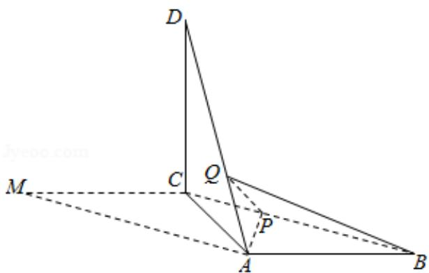

<!-- question-source:start -->
18. (12 分) 如图, 在平行四边形 ABCM 中, AB=AC=3, ∠ACM=90°, 以 AC 为折痕将

△ACM 折起，使点 M 到达点 D 的位置，且 AB⊥DA.

(1) 证明: 平面 ACD⊥平面 ABC;

(2) Q 为线段 AD 上一点, P 为线段 BC 上一点, 且 BP=DQ= $\frac{2}{3}$ DA, 求三棱锥 Q-ABP 的体积.

【考点】LF：棱柱、棱锥、棱台的体积；LY：平面与平面垂直.

【专题】35：转化思想；49：综合法；5F：空间位置关系与距离.
<!-- question-source:end -->

![[高中/真题/按年份分类/2018/2018年高考真题数学_文__山东卷__含解析版_/解答题/题目/answers/Q00031122A1.md]]
