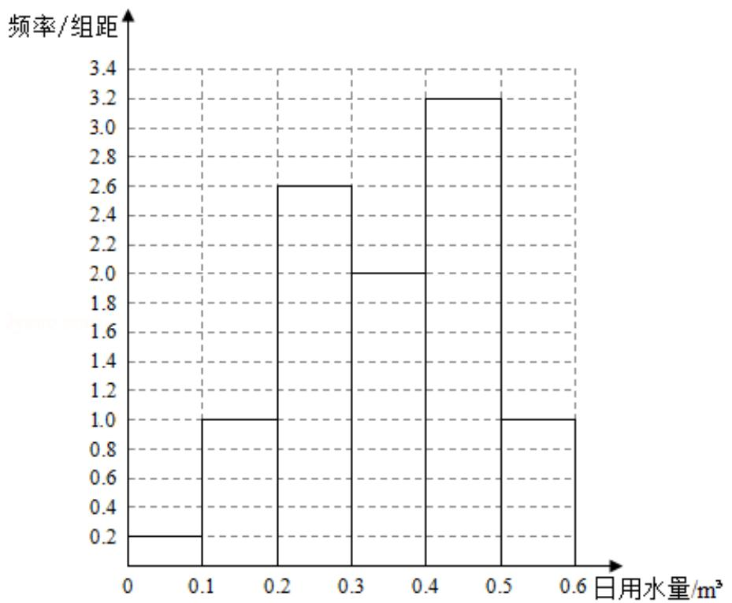

> [!faq]- 2018年高考真题数学【文】(山东卷)（含解析版）解析
>
> > [!success]- **【答案】** 详见解析
>
> > [!note]- **【分析】**
> > (1) 根据使用了节水龙头 50 天的日用水量频数分布表能作出使用了节水
>
> > [!note]- **【解析】**
> > 解：
> > （1）根据使用了节水龙头50天的日用水量频数分布表，
> >
> > 作出使用了节水龙头 50 天的日用水量数据的频率分布直方图，如下图：
> >
> > 
> > (2) 根据频率分布直方图得:
> >
> > 该家庭使用节水龙头后，日用水量小于 $0.35 \, m^{3}$ 的概率为：
> >
> > $p= \left(0.2+1.0+2.6+1\right) \times 0.1=0.
> > 48.$
> > (3) 由题意得未使用水龙头 50 天的日均水量为:
> >
> > $$
> > \frac {1}{5 0} (1 \times 0. 0 5 + 3 \times 0. 1 5 + 2 \times 0. 2 5 + 4 \times 0. 3 5 + 9 \times 0. 4 5 + 2 6 \times 0. 5 5 + 5 \times 0. 6 5) = 0. 4 8,
> > $$
> >
> > 使用节水龙头 50 天的日均用水量为：
> >
> > $$
> > \frac {1}{5 0} (1 \times 0. 0 5 + 5 \times 0. 1 5 + 1 3 \times 0. 2 5 + 1 0 \times 0. 3 5 + 1 6 \times 0. 4 5 + 5 \times 0. 5 5) = 0. 3 5,
> > $$
> >
> > $\therefore$ 估计该家庭使用节水龙头后，一年能节省： $365 \times (0.48 - 0.35) = 47.45 \mathrm{~m}^{3}$ .
> >
> > 【点评】本题考查频率分由直方图的作法, 考查概率的求法, 考查平均数的求法及
> >
> > 应用等基础知识，考查运算求解能力，考查函数与方程思想，是中档题.
