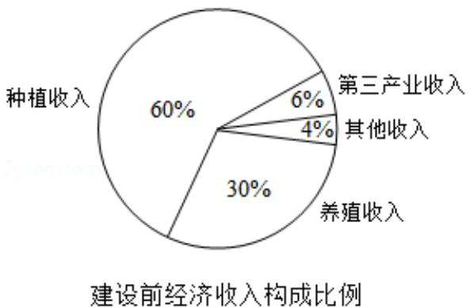
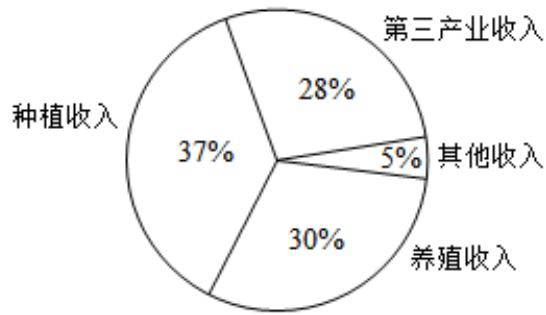

<!-- question-source:start -->
3. (5 分) 某地区经过一年的新农村建设, 农村的经济收入增加了一倍, 实现翻番
为更好地了解该地区农村的经济收入变化情况, 统计了该地区新农村建设前

后农村的经济收入构成比例，得到如下饼图：

  
建设后经济收入构成比例

则下面结论中不正确的是（）
A. 新农村建设后，种植收入减少
B. 新农村建设后，其他收入增加了一倍以上
C. 新农村建设后，养殖收入增加了一倍
D. 新农村建设后，养殖收入与第三产业收入的总和超过了经济收入的一半

【考点】2K：命题的真假判断与应用；CS：概率的应用.

【专题】11: 计算题；35: 转化思想；49: 综合法；51: 概率与统计；5L: 简易逻辑.
<!-- question-source:end -->

![[高中/真题/按年份分类/2018/2018年高考真题数学_文__山东卷__含解析版_/选择题/题目/answers/Q00030467A1.md]]
