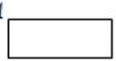
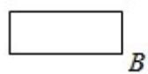
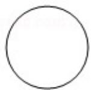

<!-- question-source:start -->
9.（5分）某圆柱的高为2，底面周长为16，其三视图如图.圆柱表面上的点M在

正视图上的对应点为 A，圆柱表面上的点 N 在左视图上的对应点为 B，则在此
圆柱侧面上，从 M 到 N 的路径中，最短路径的长度为（ ）
A. $2\sqrt{17}$ B. $2\sqrt{5}$ C. 3
D. 2

【考点】L!：由三视图求面积、体积.
【专题】11：计算题；31：数形结合；49：综合法；5F：空间位置关系与距离.
<!-- question-source:end -->

![[高中/真题/按年份分类/2018/2018年高考真题数学_文__山东卷__含解析版_/选择题/题目/answers/Q00030473A1.md]]
