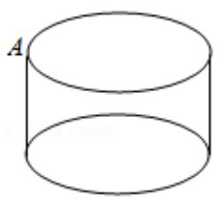
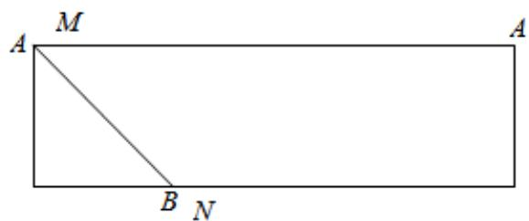

> [!faq]- 2018年高考真题数学_文__山东卷__含解析版_解析
>
> > [!success]- **【答案】** B
>
> > [!note]- **【分析】**
> > 判断三视图对应的几何体的形状，利用侧面展开图，转化求解即可.
> > 【
>
> > [!note]- **【解析】**
> > 分析】判断三视图对应的几何体的形状，利用侧面展开图，转化求解即可.
> > 【
> > 解答】解：由题意可知几何体是圆柱，底面周长16，高为：2，
> >
> > 直观图以及侧面展开图如图：
> >
> > 
> >
> > 
> >
> > 圆柱表面上的点 N 在左视图上的对应点为 B，则在此圆柱侧面上，从 M 到 N 的路径中，最短路径的长度： $\sqrt{2^{2}+4^{2}}=2\sqrt{5}$ .
> >
> > 故选：B.
> >
> > 【点评】本题考查三视图与几何体的直观图的关系, 侧面展开图的应用, 考查计算能力.
