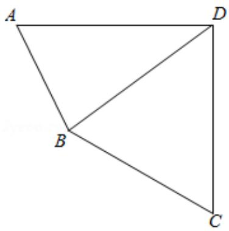

> [!faq]- 2018年高考真题数学【理】(山东卷)（含解析版）解析
>
> > [!success]- **【答案】** 详见解析
>
> > [!note]- **【分析】**
> > 本题未单列分析。
>
> > [!note]- **【解析】**
> > 解答】解：（1）∵∠ADC=90°，∠A=45°，AB=2，BD=5.
> >
> > ∴由正弦定理得： $\frac{AB}{\sin\angle ADB}=\frac{BD}{\sin\angle A}$ ，即 $\frac{2}{\sin\angle ADB}=\frac{5}{\sin45^{\circ}}$
> >
> > $$
> > \therefore \sin \angle A D B = \frac {2 \sin 4 5 ^ {\circ}}{5} = \frac {\sqrt {2}}{5},
> > $$
> >
> > $$
> > \because A B <   B D, \therefore \angle A D B <   \angle A,
> > $$
> >
> > $\therefore \cos \angle ADB = \sqrt{1 - (\frac{\sqrt{2}}{5})^2} = \frac{\sqrt{23}}{5}$ .
> >
> > (2) $\because \angle ADC = 90^{\circ}, \therefore \cos \angle BDC = \sin \angle ADB = \frac{\sqrt{2}}{5},$
> >
> > $$
> > \because D C = 2 \sqrt {2},
> > $$
> >
> > $$
> > \therefore B C = \sqrt {B D ^ {2} + D C ^ {2} - 2 \times B D \times D C \times \cos \angle B D C}
> > $$
> >
> > $$
> > = \sqrt {2 5 + 8 - 2 \times 5 \times 2 \sqrt {2} \times \frac {\sqrt {2}}{5}} = 5.
> > $$
> >
> > 
> >
> > 【点评】本题考查三角函数中角的余弦值、线段长的求法，考查正弦定理、余弦定理等基础知识，考查运算求解能力，考查函数与方程思想，是中档题.
