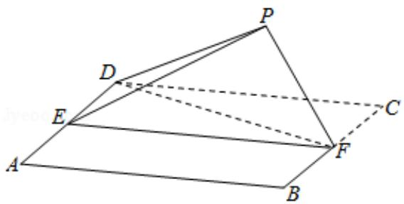

<!-- question-source:start -->
18. (12 分) 如图, 四边形 ABCD 为正方形, E, F 分别为 AD, BC 的中点, 以 DF 为折

痕把△DFC 折起，使点 C 到达点 P 的位置，且 PF⊥BF.

(1) 证明: 平面 PEF⊥平面 ABFD;

(2) 求 DP 与平面 ABFD 所成角的正弦值.

<!-- question-source:end -->

![[高中/真题/按年份分类/2018/2018年高考真题数学_理__山东卷__含解析版_/解答题/题目/answers/Q00026204A1.md]]
