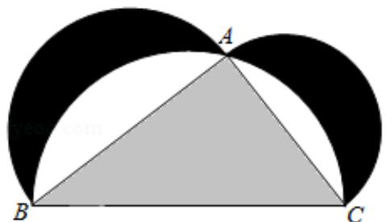

<!-- question-source:start -->
10. (5 分) 如图来自古希腊数学家希波克拉底所研究的几何图形. 此图由三个半圆构成, 三个半圆的直径分别为直角三角形 ABC 的斜边 BC, 直角边 AB, AC. △ABC 的三边所围成的区域记为 I, 黑色部分记为 II, 其余部分记为 III 在整个图形中随机取一点, 此点取自 I, II, III 的概率分别记为 $p_{1}, p_{2}, p_{3}$ , 则 ( )

A. $p_1 = p_2$ B. $p_1 = p_3$ C. $p_2 = p_3$ D. $p_1 = p_2 + p_3$
<!-- question-source:end -->

![[高中/真题/按年份分类/2018/2018年高考真题数学_理__山东卷__含解析版_/选择题/题目/answers/Q00026196A1.md]]
