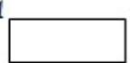
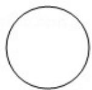

<!-- question-source:start -->
7. (5 分) 某圆柱的高为 2, 底面周长为 16, 其三视图如图. 圆柱表面上的点 M 在正视图上的对应点为 A, 圆柱表面上的点 N 在左视图上的对应点为 B, 则在此圆柱侧面上, 从 M 到 N 的路径中, 最短路径的长度为 ( )

A. $2\sqrt{17}$ B. $2\sqrt{5}$ C. 3 D. 2

【考点】L!：由三视图求面积、体积.

【专题】11：计算题；31：数形结合；49：综合法；5F：空间位置关系与距离.

【
<!-- question-source:end -->

![[高中/真题/按年份分类/2018/2018年高考真题数学_理__山东卷__含解析版_/选择题/题目/answers/Q00028872A1.md]]
