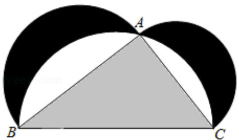

<!-- question-source:start -->
10.（5分）如图来自古希腊数学家希波克拉底所研究的几何图形。此图由三个半

圆构成，三个半圆的直径分别为直角三角形 ABC 的斜边 BC，直角边

AB, AC. △ABC 的三边所围成的区域记为 I, 黑色部分记为 II, 其余部分记为 III在整个图形中随机取一点，此点取自Ⅰ，Ⅱ，Ⅲ的概率分别记为 $p_{1}$ ， $p_{2}$ ， $p_{3}$ ，则（）

A. $p_1 = p_2$ B. $p_1 = p_3$ C. $p_2 = p_3$ D. $p_1 = p_2 + p_3$

【考点】CF：几何概型.

【专题】11：计算题；38：对应思想；40：定义法；51：概率与统计.

【
<!-- question-source:end -->

![[高中/真题/按年份分类/2018/2018年高考真题数学_理__山东卷__含解析版_/选择题/题目/answers/Q00028875A1.md]]
