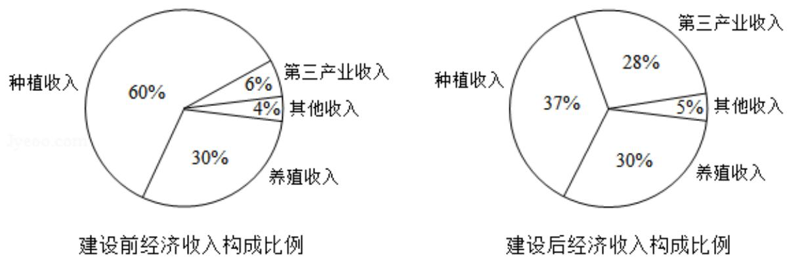

<!-- question-source:start -->
2. （5分）已知集合 $A = \{x \mid x^2 - x - 2 > 0\}$ ，则 $C_R A = (\quad)$ A. $\{x \mid -1 < x < 2\}$ B. $\{x \mid -1 \leq x \leq 2\}$ C. $\{x \mid x < -1\} \cup \{x \mid x > 2\}$ D. $\{x \mid x \leq -$

1} ∪ {x | x ≥ 2}

【考点】1F：补集及其运算.

【专题】11：计算题；35：转化思想；49：综合法；5J：集合；5T：不等式.

【
<!-- question-source:end -->

![[高中/真题/按年份分类/2018/2018年高考真题数学_理__山东卷__含解析版_/选择题/题目/answers/Q00029440A1.md]]
