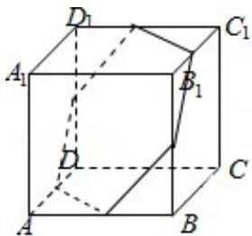

> [!faq]- 2018年高考真题数学【理】(山东卷)（含解析版）解析
>
> > [!success]- **【答案】** A
>
> > [!note]- **【分析】**
> > 利用正方体棱的关系, 判断平面 $\alpha$ 所成的角都相等的位置, 然后求解 $\alpha$ 截
> > 此正方体所得截面面积的最大值.
>
> > [!note]- **【解析】**
> > 分析】利用正方体棱的关系, 判断平面 $\alpha$ 所成的角都相等的位置, 然后求解 $\alpha$ 截
> > 此正方体所得截面面积的最大值.
> >
> > 【
> > 解答】解: 正方体的所有棱中, 实际上是 3 组平行的棱, 每条棱所在直线与平面 $\alpha$ 所成的角都相等, 如图: 所示的正六边形平行的平面, 并且正六边形时, $\alpha$ 截此正方体所得截面面积的最大,此时正六边形的边长 $\frac{\sqrt{2}}{2}$ ,
> >
> > a 截此正方体所得截面最大值为： $6 \times \frac{\sqrt{3}}{4} \times \left( \frac{\sqrt{2}}{2} \right)^{2} = \frac{3\sqrt{3}}{4}$ .
> >
> > 故选：A.
> >
> > 
> >
> > 【点评】本题考查直线与平面所成角的大小关系，考查空间想象能力以及计算能
> >
> > 力，有一定的难度.
> >
> > ##
> > 二、填空题：本题共4小题，每小题5分，共20分。
