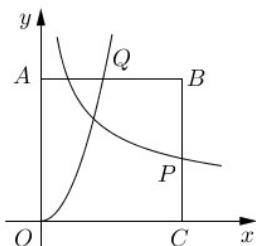

<!-- question-source:start -->
10. 如图，正方形 OABC 的边长为 $a(a>1)$ ，函数 $y=3x^{2}$ 交 AB 于点 Q，函数 $y=x^{-\frac{1}{2}}$ 与 BC 交于点 P，当 $|AQ|+|CP|$ 最小时，a 的值为 \_\_\_\_

<!-- question-source:end -->

![[高中/真题/按年份分类/2019/2019年上海高三数学春考试卷_含答案_/填空题/题目/answers/Q00023975A1.md]]
