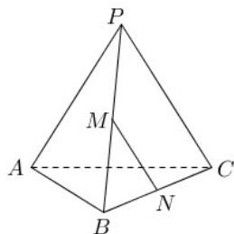

<!-- question-source:start -->
17. 如图, 正三棱锥 $P - ABC$ 中, 侧棱长为 2 , 底面边长为 $\sqrt{3}$ , $M$ 、 $N$ 分别是 $PB$ 和 $BC$ 的中点.

(1) 求异面直线 $MN$ 与 $AC$ 所成角的大小;

(2) 求三棱锥 P - ABC 的体积.

<!-- question-source:end -->

![[高中/真题/按年份分类/2019/2019年上海高三数学春考试卷_含答案_/解答题/题目/answers/Q00023982A1.md]]
