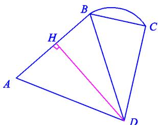

<!-- question-source:start -->
19.（本题满分14分）如图，A-B-C为海岸线，AB为线段，BC为四分之一圆弧，BD=39.2km， $\angle BDC=22^{\circ}$ ， $\angle CBD=68^{\circ}$ ， $\angle BDA=58^{\circ}$ .

(1) 求 BC 长度;

(2) 若 $AB = 40km$ ，求 $D$ 到海岸线 $A - B - C$ 的最短距离.（精确到 $0.001km$ ）

<!-- question-source:end -->

![[高中/真题/按年份分类/2019/2019年上海高考数学真题试卷_word解析版_/解答题/题目/answers/Q00029655A1.md]]
