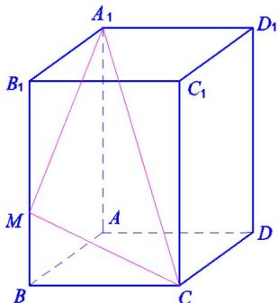

<!-- question-source:start -->
17.（本题满分14分）如图，在长方体 $ABCD - A_{1}B_{1}C_{1}D_{1}$ 中， $M$ 为 $BB_{1}$ 上一点，已知 $BM = 2$ ， $AD = 4$ ， $CD = 3$ ， $AA_{1} = 5$ .

(1) 求直线 $A_{1}C$ 与平面 ABCD 的夹角；

(2) 求点 A 到平面 $A_{1}MC$ 的距离.

<!-- question-source:end -->

![[高中/真题/按年份分类/2019/2019年上海高考数学真题试卷_word解析版_/选择题/题目/answers/Q00024024A1.md]]
