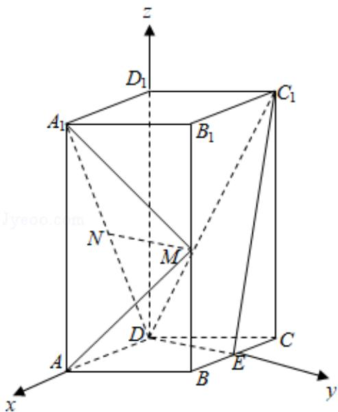
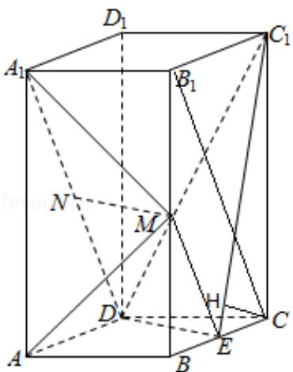

> [!faq]- 2019年全国统一高考数学试卷（文科）（新课标ⅰ）（含解析版）解析
>
> > [!success]- **【答案】** （12 分）如图，直四棱柱 $ABCD - A_{1}B_{1}C_{1}D_{1}$ 的底面是菱形， $AA_{1}=4,\ AB=2,\ \angle BAD=60^{\circ}, E, M, N$ 分别是 BC， $BB_{1}, A_{1}D$ 的中点
>
> > [!note]- **【分析】**
> > 法一：
> > (1) 连结 $B_{1}C, ME$ ，推导出四边形 $MNDE$ 是平行四边形，从而 $MN \parallel ED$ ，由此能证明 $MN \parallel$ 平面 $C_{1}DE$ .
> > （2）过 C 作 $C_{1}E$ 的垂线，垂足为 H，推导出 $DE \perp BC$ ， $DE \perp C_{1}C$ ，从而 $DE \perp$ 平面 $C_{1}CE$ ， $DE \perp CH$ ，进而 $CH \perp$ 平面 $C_{1}DE$ ，故 CH 的长即为 C 到时平面 $C_{1}DE$ 的距离，由此能求出点 C 到平面 $C_{1}DE$ 的距离.
>
> > [!note]- **【解析】**
> > 解法一：
> >
> > 证明：
> > （1）连结 $B_{1}C$ ，ME， $\because M$ ， $E$ 分别是 $BB_{1}$ ， $BC$ 的中点，
> >
> > $\therefore ME \parallel B_{1} C$ ，又 $N$ 为 $A_{1} D$ 的中点， $\therefore ND = \frac{1}{2} A_{1} D,$
> >
> > 由题设知 $A_{1}B_{1}\underline{\underline{\underline{\underline{\underline{D}}}}}C$ ， $\therefore B_1C\underline{\underline{\underline{\underline{A}}}}_1D$ ， $\therefore ME\underline{\underline{\underline{ND}}}$
> >
> > ∴四边形 MNDE 是平行四边形，
> >
> > MN||ED,
> >
> > 又 $MN \notin$ 平面 $C_{1}DE$ , $\therefore MN \parallel$ 平面 $C_{1}DE$ .
> >
> > 解：
> > （2）过 C 作 $C_{1}E$ 的垂线，垂足为 H，
> >
> > 由已知可得 $DE \perp BC$ ， $DE \perp C_{1}C$ ，
> >
> > $\therefore DE \perp$ 平面 $C_{1}CE$ ，故 $DE \perp CH$ ，
> >
> > ∴CH⊥平面 $C_{1}DE$ ，故 CH 的长即为 C 到时平面 $C_{1}DE$ 的距离，
> >
> > 由已知可得 CE=1， $CC_{1}=4$ ，
> >
> > $\therefore C_{1}E = \sqrt{17}$ ，故 $CH = \frac{4\sqrt{17}}{17}$
> >
> > ∴点 C 到平面 $C_{1}DE$ 的距离为 $\frac{4\sqrt{17}}{17}$ .
> >
> > 解法二：
> >
> > 证明：（1）∵直四棱柱 $ABCD - A_{1}B_{1}C_{1}D_{1}$ 的底面是菱形，
> >
> > $AA_{1}=4,\ AB=2,\ \angle BAD=60^{\circ},\ E,\ M,\ N$ 分别是 $BC,\ BB_{1},A_{1}D$ 的中点.
> >
> > $\therefore DD_{1} \perp$ 平面 ABCD， $DE \perp AD$ ，
> >
> > 以 D 为原点，DA 为 x 轴，DE 为 y 轴， $DD_{1}$ 为 z 轴，建立空间直角坐标系，
> >
> > $M(1, \sqrt{3}, 2), N(1, 0, 2), D(0, 0, 0), E(0, \sqrt{3}, 0), C_1(-1, \sqrt{3}, 4)$
> >
> > $\overrightarrow{\mathsf{MN}} = (0, -\sqrt{3}, 0), \overrightarrow{\mathsf{DC}_1} = (-1, \sqrt{3}, 4), \overrightarrow{\mathsf{DE}} = (0, \sqrt{3}, 0)$
> >
> > 设平面 $C_{1}DE$ 的法向量 $\vec{n}=(x,y,z)$ ，
> >
> > 则 $\left\{ \begin{array}{l} \overrightarrow{\mathrm{n}} \cdot \overrightarrow{\mathrm{DC}_1} = -\mathrm{x} + \sqrt{3}\mathrm{y} + 4\mathrm{z} = 0 \\ \overrightarrow{\mathrm{n}} \cdot \overrightarrow{\mathrm{DE}} = \sqrt{3}\mathrm{y} = 0 \end{array} \right.$
> >
> > 取 $z = 1$ ，得 $\vec{\mathfrak{n}} = (4,0,1)$
> >
> > ∵ $\overrightarrow{MN}\cdot\overrightarrow{n}=0,\quad MN\not\subset$ 平面 $C_{1}DE,$
> >
> > $\therefore MN \parallel$ 平面 $C_{1}DE$ .
> >
> > 解：
> > （2） $C(-1, \sqrt{3}, 0)$ ， $\overrightarrow{\mathrm{DC}} = (-1, \sqrt{3}, 0)$ ，平面 $C_{1}DE$ 的法向量 $\vec{n} = (4, 0, 1)$ ，
> >
> > ∴点 C 到平面 $C_{1}DE$ 的距离：
> >
> > $$
> > d = \frac {| \overrightarrow {\mathrm{DC}} \cdot \overrightarrow {\mathrm{n}} |}{| \overrightarrow {\mathrm{n}} |} = \frac {4}{\sqrt {1 7}} = \frac {4 \sqrt {1 7}}{1 7}.
> > $$
> >
> > 
> >
> > 
