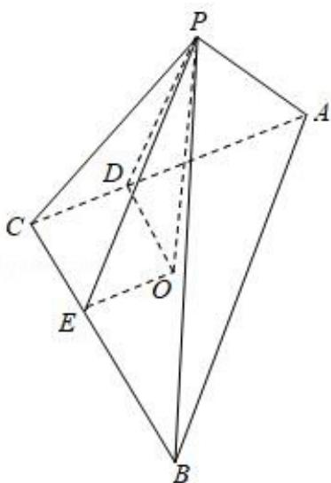

> [!faq]- 2019年全国统一高考数学试卷（文科）（新课标ⅰ）（含解析版）解析
>
> > [!success]- **【答案】** $\sqrt{2}$
>
> > [!note]- **【分析】**
> > 过点 $P$ 作 $PD \perp AC$ , 交 $AC$ 于 $D$ , 作 $PE \perp BC$ , 交 $BC$ 于 $E$ , 过 $P$ 作 $PO \perp$ 平面 $ABC$ , 交平面 $ABC$ 于 $O$ , 连结 $OD$ , $OC$ , 则 $PD = PE = \sqrt{3}$ , 从而 $CD = CE = OD = OE =$
>
> > [!note]- **【解析】**
> > 解： $\angle ACB = 90^{\circ}$ ， $P$ 为平面 $ABC$ 外一点， $PC = 2$ ，点 $P$ 到 $\angle ACB$ 两边 $AC$ ， $BC$ 的距离均为 $\sqrt{3}$ ，
> >
> > 过点 $P$ 作 $PD \perp AC$ ，交 $AC$ 于 $D$ ，作 $PE \perp BC$ ，交 $BC$ 于 $E$ ，过 $P$ 作 $PO \perp$ 平面 $ABC$ ，交平面 $ABC$ 于 $O$ ，
> >
> > 连结 OD，OC，则 $PD=PE=\sqrt{3}$ ，
> >
> > $$
> > \therefore C D = C E = O D = O E = \sqrt {2 ^ {2} - (\sqrt {3}) ^ {2}} = 1,
> > $$
> >
> > $$
> > \therefore P O = \sqrt {P D ^ {2} - O D ^ {2}} = \sqrt {3 - 1} = \sqrt {2}.
> > $$
> >
> > ∴P 到平面 ABC 的距离为 $\sqrt{2}$ .
> >
> > 故答案为： $\sqrt{2}$ .
> >
> > 
> >
> > 【点评】本题考查点到平面的距离的求法，考查空间中线线、线面、面面间的位置关系等基础知识，考查推理能力与计算能力，属于中档题.
