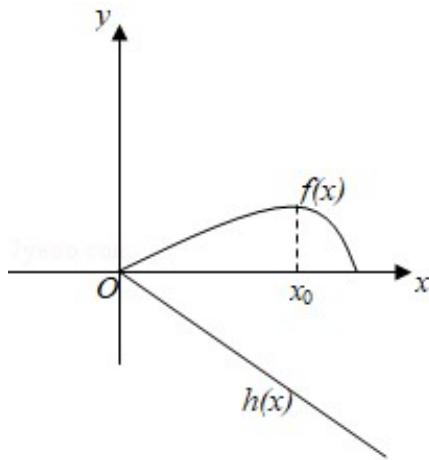

> [!faq]- 2019年全国统一高考数学试卷（文科）（新课标ⅰ）（含解析版）解析
>
> > [!success]- **【答案】** 0 号学生 C
>
> > [!note]- **【分析】**
> > (1) 令 $g(x) = f'(x)$ ，对 $g(x)$ 再求导，研究其在 $(0, \pi)$ 上的单调性，结合极值点和端点值不难证明；
> > (2) 利用
> > (1) 的结论, 可设 $f'(x)$ 的零点为 $x_0$ , 并结合 $f'(x)$ 的正负分析得到 $f(x)$ 的情况, 作出图示, 得出结论.
>
> > [!note]- **【解析】**
> > 解：
> > (1)
> >
> > 证明：∵f(x)=2sinx-xcosx-x,
> >
> > $\therefore f'(x) = 2\cos x - \cos x + x\sin x - 1$
> >
> > $$
> > = \cos x + x \sin x - 1,
> > $$
> >
> > 令 $g(x) = \cos x + x\sin x - 1$
> >
> > 则 $g^{\prime}(x) = -\sin x + \sin x + x\cos x$
> >
> > $= x\cos x$
> >
> > 当 $x \in (0, \frac{\pi}{2})$ 时， $x \cos x > 0$
> >
> > 当 $x \in (\frac{\pi}{2}, \pi)$ 时， $x \cos x < 0$
> >
> > ∴当 $x=\frac{\pi}{2}$ 时，极大值为 $g\left(\frac{\pi}{2}\right)=\frac{\pi}{2}-1>0$ ，
> >
> > 又 $g(0) = 0, g(\pi) = -2,$
> >
> > $\therefore g(x)$ 在 $(0, \pi)$ 上有唯一零点，
> >
> > 即 $f'(x)$ 在 $(0, \pi)$ 上有唯一零点；
> > (2)
> >
> > 由
> > （1）知， $f'(x)$ 在 $(0, \pi)$ 上有唯一零点 $x_{0}$ ，
> >
> > 使得 $f'(x_{0})=0$ ,
> >
> > 且 $f'(x)$ 在 $(0, x_0)$ 为正，
> >
> > 在 $(x_0, \pi)$ 为负，
> >
> > $\therefore f(x)$ 在 $[0, x_0]$ 递增，在 $[x_0, \pi]$ 递减，
> >
> > 结合 $f(0) = 0$ ， $f(\pi) = 0$
> >
> > 可知 $f(x)$ 在 $[0, \pi]$ 上非负，
> >
> > 令 $h(x) = ax$
> >
> > 作出图示，
> >
> > $\because f(x) \geqslant h(x)$ ,
> >
> > $\therefore a\leq0,$
> >
> > ∴a 的取值范围是 $(-∞, 0]$ .
> >
> > 
