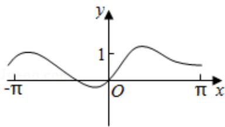
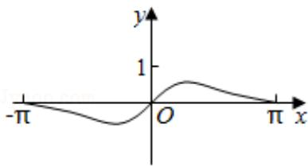
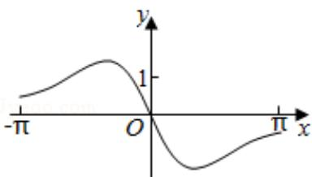
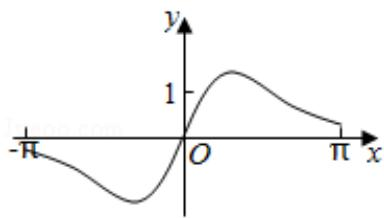

<!-- question-source:start -->
5. (5分) 函数 $f(x) = \frac{\sin x + x}{\cos x + x^2}$ 在 $[- \pi, \pi]$ 的图象大致为（）

  
A.

B.

C.

D.

<!-- question-source:end -->

![[高中/真题/按年份分类/2019/2019年全国统一高考数学试卷_文科__新课标ⅰ__含解析版_/选择题/题目/answers/Q00024752A1.md]]
