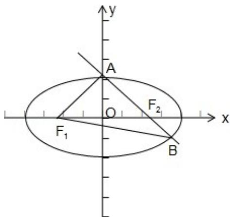

> [!faq]- 2019年全国统一高考数学试卷（文科）（新课标ⅰ）（含解析版）解析
>
> > [!success]- **【答案】** B
>
> > [!note]- **【分析】**
> > 根据椭圆的定义以及余弦定理列方程可解得 $a = \sqrt{3}$ ， $b = \sqrt{2}$ ，可得椭圆的方程.
> > 【
>
> > [!note]- **【解析】**
> > 分析】根据椭圆的定义以及余弦定理列方程可解得 $a = \sqrt{3}$ ， $b = \sqrt{2}$ ，可得椭圆的方程.
> > 【
> > 解答】解： $\because |AF_2| = 2|BF_2|$ ， $\therefore |AB| = 3|BF_2|$ 又 $|AB| = |BF_1|$ ， $\therefore |BF_1| = 3|BF_2|$
> >
> > 又 $|BF_{1}|+|BF_{2}|=2a,\quad\therefore|BF_{2}|=\frac{a}{2},$
> >
> > $$
> > \therefore | A F _ {2} | = a, \quad | B F _ {1} | = \frac {3}{2} a,
> > $$
> >
> > $$
> > \because \left| A F _ {1} \right| + \left| A F _ {2} \right| = 2 a, \therefore \left| A F _ {1} \right| = a,
> > $$
> >
> > $\therefore |AF_1| = |AF_2|$ ， $\therefore A$ 在 $y$ 轴上.
> >
> > 在 $\mathrm{Rt}\triangle AF_2O$ 中， $\cos \angle AF_2O = \frac{1}{a}$
> >
> > 在 $\triangle BF_{1}F_{2}$ 中，由余弦定理可得 $\cos \angle BF_{2}F_{1} = \frac{4 + (\frac{a}{2})^{2} - (\frac{3}{2} a)^{2}}{2\times 2\times\frac{a}{2}}$
> >
> > 根据 $\cos \angle AF_2O + \cos \angle BF_2F_1 = 0$ ，可得 $\frac{1}{a} +\frac{4 - 2a^2}{2a} = 0$ ，解得 $a^2 = 3$ ， $\therefore a = \sqrt{3}.$
> >
> > $$
> > b ^ {2} = a ^ {2} - c ^ {2} = 3 - 1 = 2
> > $$
> >
> > 所以椭圆 $C$ 的方程为： $\frac{x^2}{3} +\frac{y^2}{2} = 1.$
> >
> > 故选：B.
> >
> > 
> >
> > 【点评】本题考查了椭圆的性质，属中档题.
> >
> > ## 二、填空题：本题共4小题，每小题5分，共20分。
