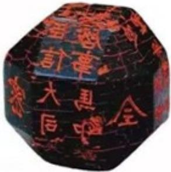
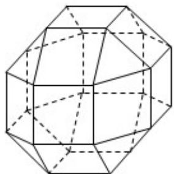

<!-- question-source:start -->
16. (5 分) 中国有悠久的金石文化, 印信是金石文化的代表之
一. 印信的形状多为长方体、正方体或圆柱体, 但南北朝时期的官员独孤信的印信形状是 “半正多面体” (图 1). 半正多面体是由两种或两种以上的正多边形围成的多面体. 半正多面体体现了数学的对称美. 图 2 是一个棱数为 48 的半正多面体, 它的所有顶点都在同一个正方体的表面上, 且此正方体的棱长为 1. 则该半正多面体共有 \_\_\_\_ 个面, 其棱长为 \_\_\_\_.

  
图1

  
图2

##
三、解答题: 共 70 分。解答应写出文字说明、证明过程或演算步骤。第 17～21 题为必考题, 每个试题考生都必须作答。第 22、23 题为选考题, 考生根据要求作答。

（一）必考题：共60分。
<!-- question-source:end -->

![[高中/真题/按年份分类/2019/2019年全国统一高考数学试卷_文科__新课标ⅱ__含解析版_/填空题/题目/answers/Q00031077A1.md]]
